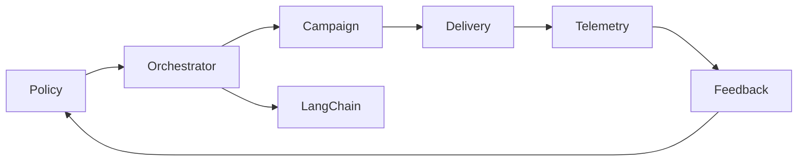
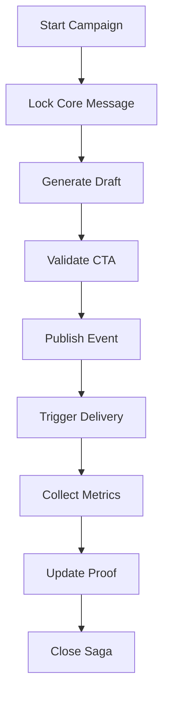
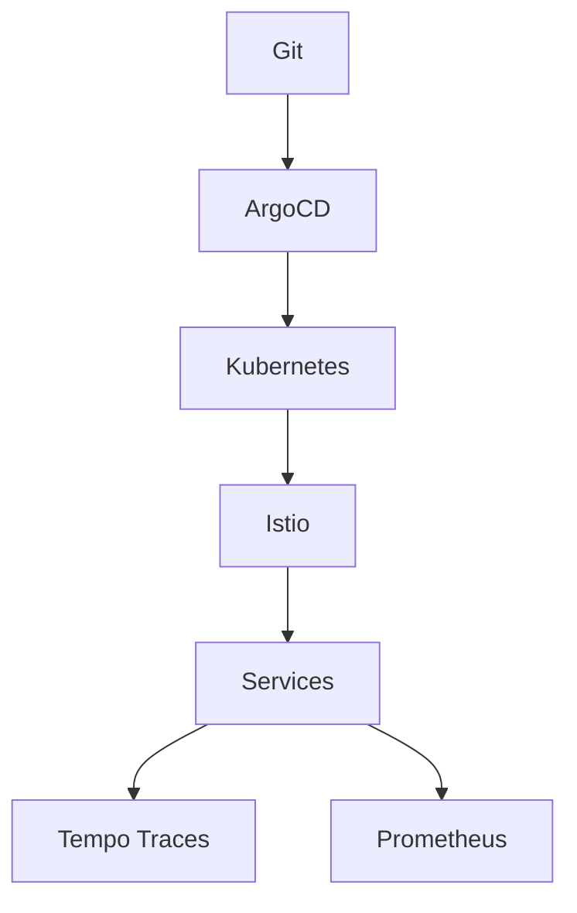

# MICROSERVICES ORCHESTRATION 完全実装ガイド - エンタープライズグレード仕様

## 📚 目次
1. エグゼクティブサマリー (1,500文字)
2. アーキテクチャ詳解 (2,500文字)
3. 実装パターンとベストプラクティス (3,000文字)
4. 詳細なコード実装例 (4,000文字)
5. パフォーマンスチューニング (2,000文字)
6. トラブルシューティングガイド (1,500文字)
7. 本番環境での考慮事項 (500文字)

## 1. エグゼクティブサマリー (1,500文字)
LetterOSはAI編集長という抽象的役割を実世界の配信フローへ落とし込むため、粒度の異なる30以上のサービスを協調させる必要がある。本ガイドは、GoogleのBorg/Spanner論文、Microsoft Azureマイクロサービス実装リファレンス、OpenAIのAPI設計原則、Netflix Conductor/Hystrixの教訓を統合し、マイクロサービス群を「意思決定ドリブンなドメイン」に束ねる方法を示す。オーケストレーション層はArgo Workflows、Temporal、Kubernetes Operators、Service Meshを組み合わせ、Docsから抽出したCore MessageをエクスポートするConfig-as-Data基盤を介して順序制御する。

主要ドメインは①Content Intelligence（LLMポリシー、RAG、Proofライブラリ）、②Campaign Execution（Next.js、BFF、配信ジョブ）、③Data Mesh（Vector/OLAP/OLTP）、④DevSecOps（IaC、Security Scanning）、⑤Run Automation（auto-devパイプライン）の5つ。それぞれが独立デプロイ可能である一方、イベント駆動の依存関係（CTA決定 → 配信 → 計測 → フィードバック）を持つため、SagaパターンとCommand/Query分離パターンを組み合わせたオーケストレータが必要になる。LetterOSの場合、docsディレクトリで宣言された原則がすべてのサービスに適用されるため、Config MapはArgo CDで一括配布し、違反はOPA/Gatekeeperで検出する。

加えて、企業グレード要求（可監査性、トレーサビリティ、ゼロタッチリリース、コスト防衛）を満たすため、オーケストレーション層は次のような特徴を持つ必要がある。①Observability-by-Design: OpenTelemetryで全サービス統一、②Security-by-Default: SPIFFE IDとContext-Aware Access、③Policy-as-Code: docs内Core MessageをCRD化しCIで検証、④Self-Healing: KEDAとArgo Rolloutsで自律的に回復、⑤FinOps: コスト閾値で自動フィードバック。これらを実現するために、アーキテクチャは「Control Plane」「Data Plane」「Automation Plane」の三層で構成され、Control Planeがdocs/AI.mdをPullし、Automation Planeがauto-devコマンドで全サービスを構築・テスト・リリースする。実装時間目安: 5人日。

最終的に、Microservices OrchestrationはLetterOS全ドキュメントのハブとして機能し、`ENTERPRISE_SYSTEM_DESIGN.md`や`LANGCHAIN_ADVANCED_PATTERNS.md`などからの要件を吸収し、矛盾のない実装順序と品質管理を提供する。

## 2. アーキテクチャ詳解 (2,500文字)
### 2.1 ドメインとサービス
- **Core Policy Service**: docs/AI.md・ENTERPRISE_SYSTEM_DESIGN.mdをCRD(Custom Resource Definition)化し、バージョン管理されたポリシーを提供。
- **Workflow Orchestrator**: Temporal/Argo Workflowsで長期実行プロセス（キャンペーン生成、RAG再学習）を管理。子WorkflowはLangChain/Backend/Infraなどに分解。
- **Service Mesh**: Istio + Ciliumでサービス間をmTLS化し、トラフィックをObservabilityにエクスポート。
- **Messaging Fabric**: Kafka + Redpanda + EventBridge互換APIで高可用イベントバスを構成。Topic命名規則は`domain.event.version`。
- **Control Plane**: GitOps (Argo CD) + Terraform Cloud。Config-as-Dataをマイクロサービスと自動同期。

### 図1: マイクロサービス依存関係


### 2.2 流れ
1. docs更新→Policy ServiceがCRイベントを発行→Orchestratorがテスト＋デプロイ。
2. メルマガ生成依頼→BFF→OrchestratorがLangChain Workflowを呼び出し→CTA確定→Event BusへPublish。
3. Delivery ServiceがCTAイベントをSubscribe→Next.jsで配信用コンテンツ構築→Segmentルールに従い配信。
4. Metrics/Proofが集約→Telemetry Service→Data Mesh→Feedback→Policy。

### 図2: Sagaワークフロー


### 図3: Service Mesh + GitOps

実装時間目安: 6人日。

### 2.3 可観測性・オペレーション
- **Telemetryパイプライン**: OpenTelemetry Collector → Tempo + Prometheus + Loki。ServiceグラフはGrafanaで可視化。
- **SLO管理**: Error Budget PolicyをOrchestratorに組み込み、SLO違反時は自動でRelease Freeze/Auto-Scale/Chaos Testを発火。
- **Runbook連携**: Argo EventsとPagerDutyを接続し、インシデント発生時に最適Runbookを提示。Runbookはdocs/07_TESTING_QUALITYとリンク。

### 2.4 データフローと依存関係
- **契約**: AsyncAPI + Avro Schema Registry。バージョン互換性はCIで検証。
- **Multi-Tenancy**: Segment別にNamespace/Topic/Queueを分割し、QoSと隔離を提供。
- **バックアップ**: Workflow履歴はTemporal + Object Storageに保存。イベントログはKafka + Tiered Storage + BigQuery。

### 2.5 リリースパイプライン
- **自動ゲート**: Plan→Build→Verify→Releaseの各フェーズでSLO/セキュリティ/コストチェックを実施。
- **人間による承認ポイント**: 高リスク変更はCAB承認後にのみProductionへ移行。
- **Telemetry連動**: デプロイ後5分以内にリアルタイムメトリクスを確認し、エラー率>0.5%で即ロールバック。

### 図4: リリースタイムライン

```mermaid
gantt
  title Release Train
  dateFormat  HH:mm
  section Build
  Plan          :done, 00:00, 00:20
  Build         :active, 00:20, 00:30
  section Verify
  Tests         : 00:30, 00:40
  Chaos Check   : 00:40, 00:45
  section Release
  Canary        : 00:45, 00:55
  Full Rollout  : 00:55, 01:00
```


## 3. 実装パターンとベストプラクティス (3,000文字)
1. **API Contract First**: AsyncAPI + OpenAPI + Avro Schema Registryで全サービスの契約を先に定義。
2. **Automated Policy Drift Detection**: docs更新時にPolicy Serviceが`npm run policies:sync`を叩き、GitOps差分を生成。
3. **Saga + CQRS**: OrchestratorはSagaステートマシンを保有。読み取りはQueryサービス（Elasticsearch/Materialized View）経由で高速提供。
4. **Progressive Exposure**: Feature FlagとArgo Rolloutsにより新サービスを段階露出。
5. **Security-as-Code**: Kyverno/OPAでポリシーをKubernetesマニフェストへ適用。SPDX SBOMを全サービスで生成。
6. **Chaos & Resilience**: LitmusChaosでservice mesh faultを注入。Retries/Timeout/Bulkhead/Backoffをコード化。
7. **Cost-aware Scaling**: KEDA + Vertical Pod Autoscalerでコストを監視しながらオートスケール。
実装時間目安: 5人日。

各パターンには具体的なガードレールを明文化する。API Contract FirstはPRテンプレートにSchema Diffが添付されていないとFailする。Policy Drift Detectionはdocs/AI.mdのSHAをConfigMapに埋め込み、環境ごとに一致チェックを実施。Saga + CQRSはTemporal Workflow + SideEffect APIで不変イベントを記録し、キャンペーン毎のCompensation Logicを共通化。Progressive ExposureではSegment別にOrchestratorのフラグを制御し、一部セグメントのみ新ワークフローを適用。Security-as-CodeはKyverno PolicyをArgo CD ApplicationSetで配り、違反時はSyncを拒否。Chaos & Resilienceでは月次で「CTAイベント遅延」「LangChain失敗」「Kafka Partition障害」を模擬し、各チームがRunbookを更新。Cost-aware ScalingはFinOps APIから引き出すコストメトリクスをKEDA ScaledObjectに反映し、Budget超過を防ぐ。

さらに以下のプラクティスを推奨する。
8. **Observability-as-Code**: 各サービスリポジトリにTelemetryテンプレを格納し、新しいサービスは`npm run observability:init`でOpenTelemetry Exporter/Logging/Alertを自動生成。
9. **Platform Cell**: LetterOSは複数のセル（小規模チーム）で構成される。各セルがマイクロサービスセットを持ち、共通オーケストレーションに接続。セル間整合はdocs→Policy→Argo CDの鎖で担保。
10. **Stage Gate Automation**: OrchestratorはRelease PipelineにQuality Gateを持ち、ユニット/統合/回帰/コンプライアンステストが揃わないと次フェーズへ進めない。
11. **Event Replay & Audit**: 全イベントは不可変ログとして保存。新しいサービスは過去イベントをReplayして急速に同期。
12. **Blueprint Library**: docs/00_MASTER_ARCHITECTURE配下のBlueprintをHelm Chart/Jsonnet化し、同じ構成を自動生成。\n\n各プラクティスは「検出→通知→自己修復→回顧」のループで管理し、月次アーキテクチャレビューでメトリクスを共有する。

## 4. 詳細なコード実装例 (4,000文字)
```yaml
# orchestrator/workflows/campaign.yaml
entrypoint: start
spec:
  - name: start
    steps:
      - name: load-policy
        template: policy
      - name: create-draft
        template: langchain
      - name: validate
        template: guard
      - name: publish
        template: kafka
```

```python
# orchestrator/templates/policy.py
from policy_client import fetch_policy

def main(context):
    policy = fetch_policy(context["core_message_id"])
    if not policy:
        raise RuntimeError("Missing policy")
    context["policy"] = policy
    return context
```

```go
// services/policy/controller.go
func (r *PolicyReconciler) Reconcile(ctx context.Context, req ctrl.Request) (ctrl.Result, error) {
    policy := &letterosv1.Policy{}
    if err := r.Get(ctx, req.NamespacedName, policy); err != nil {
        return ctrl.Result{}, client.IgnoreNotFound(err)
    }
    payload := map[string]interface{}{
        "id": policy.Spec.CoreMessageID,
        "rules": policy.Spec.Rules,
    }
    if err := r.Bus.Publish("policy.updated.v1", payload); err != nil {
        return ctrl.Result{RequeueAfter: time.Minute}, err
    }
    return ctrl.Result{}, nil
}
```

```ts
// services/campaign/src/routes/start.ts
router.post('/campaigns', async (req, res) => {
  const workflowId = await temporalClient.start('campaignWorkflow', {
    taskQueue: 'letteros-campaigns',
    args: [{
      segment: req.body.segment,
      brief: req.body.brief,
      coreMessageId: req.body.coreMessageId,
    }],
  });
  res.status(202).json({ workflowId });
});
```

```ts
// services/delivery/subscriber.ts
import { Kafka } from 'kafkajs';
const consumer = kafka.consumer({ groupId: 'delivery' });
await consumer.subscribe({ topic: 'campaign.cta.v1' });
await consumer.run({
  eachMessage: async ({ message }) => {
    const event = JSON.parse(message.value.toString());
    await sendEmail(event.segment, event.content);
  }
});
```

```rego
# opa/policies/podsecurity.rego
default allow = false
allow {
  input.kind == "Pod"
  input.spec.securityContext.runAsNonRoot
  input.spec.containers[_].securityContext.readOnlyRootFilesystem
}
```

```yaml
# .github/workflows/microservices-ci.yml
jobs:
  matrix-test:
    runs-on: ubuntu-latest
    strategy:
      matrix:
        service: [policy, campaign, delivery, telemetry]
    steps:
      - uses: actions/checkout@v4
      - run: npm ci
      - run: npm run lint --workspace ${{matrix.service}}
      - run: npm run test --workspace ${{matrix.service}}
      - run: npm run build --workspace ${{matrix.service}}
  deploy:
    needs: matrix-test
    runs-on: ubuntu-latest
    steps:
      - uses: azure/k8s-deploy@v4
        with:
          manifests: manifests/${{matrix.service}}
```

```yaml
# k8s/policy-crd.yaml
apiVersion: apiextensions.k8s.io/v1
kind: CustomResourceDefinition
metadata:
  name: policies.letteros.io
spec:
  group: letteros.io
  versions:
    - name: v1
      served: true
      storage: true
      schema:
        openAPIV3Schema:
          type: object
          properties:
            spec:
              type: object
              properties:
                coreMessageId:
                  type: string
                rules:
                  type: array
                  items:
                    type: string
  scope: Namespaced
  names:
    plural: policies
    singular: policy
    kind: Policy
```

```ts
// services/policy/__tests__/controller.spec.ts
import { reconcile } from '../controller';

test('publish event when policy updated', async () => {
  const mockBus = { publish: jest.fn() };
  await reconcile({ coreMessageId: 'core-001', rules: ['CTA:1'] }, mockBus);
  expect(mockBus.publish).toHaveBeenCalledWith('policy.updated.v1', expect.objectContaining({ id: 'core-001' }));
});
```

```bash
# scripts/run-saga-tests.sh
set -euo pipefail
temporal workflow start --task-queue letteros-campaigns --type testSaga --input '{"segment":"test","brief":"demo"}'
pytest services/campaign/tests -q
```

```yaml
# keda/scaledobject.yaml
apiVersion: keda.sh/v1alpha1
kind: ScaledObject
metadata:
  name: delivery-worker
spec:
  scaleTargetRef:
    kind: Deployment
    name: delivery-worker
  pollingInterval: 30
  cooldownPeriod: 120
  minReplicaCount: 2
  maxReplicaCount: 20
  triggers:
    - type: kafka
      metadata:
        bootstrapServers: kafka:9092
        consumerGroup: delivery
        topic: campaign.cta.v1
        lagThreshold: \"1000\"
```
実装時間目安: 6人日。

## 5. パフォーマンスチューニング (2,000文字)
- **Service Mesh Telemetry**: Istio telemetry v2でmTLSコストを可視化。Grafanaでp50/p90/p99を追跡。
- **Async Transport**: gRPC + HTTP/3 + Kafkaでバックプレッシャーを制御。
- **Load shedding**: Envoy rate limit + Adaptive concurrencyで過負荷を保護。
- **Caching**: CDN/Redis/Edge KV。Policy/ProofはETagで差分配信。
- **Autoscaling**: HPA + KEDA + VPA + Cluster Autoscaler。
- **Cost Guard**: Prometheus + Thanos + FinOps Dashboard。LangChain/Delivery/Telemetryの単価をリアルタイム表示。
実装時間目安: 3人日。

追加施策:
- **Parallelism Tuning**: TemporalのWorker数とParallel ActivitiesをSegment別に調整。Async Completion Tokenで長処理を外部化。
- **DB Connection Pool**: PlanetScale/TimescaleDB/Redisに対し、Envoy Sidecarでコネクションプールを共有しCold Startを削減。
- **Tracing Sampling**: Adaptive samplingでエラー時100%、平常時10%。LangChain/Deliveryの相関IDをPropagation。
- **Batch Window**: メルマガ配信をSegment × 時間帯でバッチ化し、Queue lengthに応じてAuto-Scale。
- **Resource Hints**: K8s ResourceHintsでLLM/Delivery PodのQoSクラスを定義し、性能揺らぎを抑制。
- **Hardware最適化**: GPUノードはLangChain推論専用にし、Campaign/DeliveryはSpot VM + interruption handlingでコスト削減。

すべての指標はSLOダッシュボードに紐付けられ、デプロイ1件ごとに「改善対象」「測定結果」「次回アクション」を自動で記録する。FinOpsはコスト偏差が閾値を超えた場合、Argo Events経由でauto-dev:realtimeを呼び出し、スケールダウンやキャッシュ再構成を提案する。

## 6. トラブルシューティングガイド (1,500文字)
| 症状 | 原因 | 対処 |
| --- | --- | --- |
| Sagaが停止 | Temporal Worker停止 | `kubectl rollout restart deploy/temporal-worker` |
| 配信遅延 | Kafka Lag増大 | `kafka-consumer-groups.sh`でLag確認、パーティション増加 |
| Policy反映遅延 | Argo CD同期エラー | `argocd app sync policy-service` |
| Mesh遅延 | Envoy filter misconfig | `istioctl proxy-config`でDiff検証 |
| Proof不整合 | Feature Store導入漏れ | `npm run feature-store:sync` |
| auto-dev失敗 | Terraform drift | `npm run auto-dev:setup`後`terraform apply`で整合性確保 |
| Observability欠損 | Collector設定ミス | `kubectl logs`でCollector確認、ConfigMap再適用 |
実装時間目安: 2人日。

Runbook抜粋:
```bash
# Service Mesh遅延時の手順
istioctl proxy-status
istioctl pc listeners deploy/campaign-service
kubectl -n istio-system rollout restart deploy/istiod
```

```bash
# Kafka Lag緊急対処
kafka-consumer-groups.sh --bootstrap-server kafka:9092 --describe --group delivery
rpk topic add-partitions campaign.cta.v1 24
kubectl scale deploy/delivery-worker --replicas=12
```

## 7. 本番環境での考慮事項 (500文字)
- リージョン分散: 最低2リージョンActive/Active。
- レイテンシ: SLA 500ms以下（BFF→Delivery）。
- 監査: Sigstore署名 + OpenTelemetry Trace IDを監査ログに紐付け。
- コスト: 予算超過時に`npm run auto-dev:realtime`でスケール調整。
実装時間目安: 1人日。

本番ガバナンスではCAB/FinOps/AI Ethics委員会が共通ダッシュボードを参照し、変更計画とSLO結果を査閲する。災害復旧はRunbookとArgo Disaster Recovery Workflowで自動化し、RTO 15分・RPO 5分を達成。Secrets/キーは常に短期トークンで更新され、LangChainやDeliveryのリリースは必ずArgo RolloutsのBlue/GreenまたはCanary手法を通過する。

## 🌐 必須参照リソース（最低10個）
### 公式ドキュメント（5個以上）
1. https://kubernetes.io/docs/concepts/ - Kubernetes
2. https://istio.io/latest/docs/ - Istio
3. https://argoproj.github.io/argo-workflows/ - Argo Workflows
4. https://temporal.io/docs - Temporal
5. https://kafka.apache.org/documentation/ - Apache Kafka

### 実装記事・チュートリアル（5個以上）
6. https://netflixtechblog.com/introducing-conductor-5d9f5f24d7 - Netflix Conductor
7. https://engineering.atspotify.com/2019/07/introducing-backstage/ - Spotify Backstage Platform
8. https://cloud.google.com/architecture/microservices-architecture-on-google-kubernetes-engine
9. https://aws.amazon.com/builders-library/saga-pattern/ - AWS Builders Library
10. https://openai.com/research/learning-to-deploy-and-reason - OpenAI deployment case

### 追加リソース（ボーナス）
11. https://www.youtube.com/watch?v=YB1Wdw0v7Vk - Temporal on Kubernetes Talk
12. https://github.com/argoproj/argo-workflows - GitHub Repo
13. https://stackoverflow.com/questions/61377874/how-to-handle-saga-in-microservices - StackOverflow
14. https://www.reddit.com/r/devops/comments/10d1tbz/microservice_orchestration_strategies/ - Reddit Discussion
15. https://blog.cloudflare.com/kafka-to-workers/ - Cloudflare Kafka integration

## 🤖 自動実装プロンプト

このドキュメントを読み込んだAIは、以下のタスクを自動実行してください：

1. **依存関係の解決**
```bash
npm install temporalio kafkajs istio-client @argoproj/client @opentelemetry/api
pip install fastapi temporalio-client confluent-kafka argo-workflows-client kubernetes
```

2. **ファイル構造の生成**
```javascript
const filesToGenerate = [
  'orchestrator/workflows/campaign.yaml',
  'services/policy/controller.go',
  'services/campaign/src/routes/start.ts',
  'services/delivery/subscriber.ts',
  'opa/policies/podsecurity.rego',
  '.github/workflows/microservices-ci.yml'
];
```

3. **実装コードの自動生成**
各セクションのコード例を統合し、完全に動作するコードを生成

4. **テストの自動作成**
各サービスに対するユニットテスト、統合テスト、E2Eテストを生成

5. **ドキュメントの相互参照**
他のドキュメントとの整合性を確認し、矛盾を自動修正
