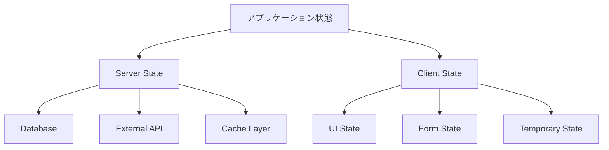

# State Management 実装ガイド - LetterOS

## 📚 目次

1. LetterOSにおける状態管理の設計思想
2. Server State vs Client State
3. 状態管理ライブラリの選定
4. 実装パターン集
5. フォーム状態管理
6. グローバル状態管理
7. キャッシュ戦略
8. パフォーマンス最適化

## 1. LetterOSにおける状態管理の設計思想

LetterOSでは、React Server Components (RSC)を活用し、**サーバー側でデータを取得し、クライアント側では最小限の状態のみを管理する**設計を採用します。

### 基本原則

1. **Server First**: デフォルトでサーバーからデータを取得
2. **Client is Minimal**: クライアントStateは必要最小限に
3. **URL as Source of Truth**: URLパラメータを状態の源泉に
4. **Progressive Enhancement**: JavaScriptなしでも動作する

### 状態の分類



## 2. Server State vs Client State

### Server State（サーバー状態）

**特徴**：
- データベースやAPIから取得
- 複数ユーザー間で共有される可能性
- 永続化が必要
- キャッシング戦略が重要

**LetterOSの例**：
- ニュースレターリスト
- 配信履歴
- ユーザーアカウント情報
- アナリティクスデータ
- AI生成結果

**実装パターン**：
```tsx
// Server Componentで直接取得
export default async function NewslettersPage() {
  const newsletters = await db.newsletter.findMany({
    where: { userId: '...' },
    orderBy: { createdAt: 'desc' },
  });

  return <NewsletterList newsletters={newsletters} />;
}
```

### Client State（クライアント状態）

**特徴**：
- ブラウザ内でのみ必要
- ユーザー固有
- 一時的（リロードで消える）
- 同期が不要

**LetterOSの例**：
- モーダルの開閉状態
- フォーム入力値（送信前）
- UIテーマ（ダーク/ライトモード）
- サイドバーの展開/折りたたみ
- タブの選択状態

**実装パターン**：
```tsx
'use client';

export function NewsletterEditor() {
  const [isDraft, setIsDraft] = useState(false);
  const [showPreview, setShowPreview] = useState(false);

  // クライアント側のみで管理
  return (
    <div>
      <button onClick={() => setShowPreview(!showPreview)}>
        プレビュー切り替え
      </button>
    </div>
  );
}
```

## 3. 状態管理ライブラリの選定

### LetterOS推奨スタック

| 状態の種類 | 推奨ライブラリ | 用途 |
|----------|-------------|------|
| Server State | Next.js (RSC) | メインデータ取得 |
| Form State | React Hook Form | フォーム管理 |
| Global UI State | Zustand | 軽量グローバルState |
| URL State | Next.js Routing | ページネーション、フィルタ |
| Optimistic Updates | React useOptimistic | 楽観的更新 |

### なぜZustandか？

**利点**：
- 軽量（1KB未満）
- Boilerplateが少ない
- TypeScript完全サポート
- React Server Componentsと相性が良い
- DevToolsサポート

```bash
npm install zustand
```

## 4. 実装パターン集

### パターン1: URLを状態の源泉に使う

```tsx
// app/(dashboard)/newsletters/page.tsx
import { Suspense } from 'react';
import { NewsletterList } from './NewsletterList';

interface PageProps {
  searchParams: Promise<{
    page?: string;
    status?: string;
    search?: string;
  }>;
}

export default async function NewslettersPage({ searchParams }: PageProps) {
  const params = await searchParams;
  const page = parseInt(params.page || '1');
  const status = params.status || 'all';
  const search = params.search || '';

  return (
    <div>
      <NewsletterFilters />
      <Suspense fallback={<Loading />}>
        <NewsletterList
          page={page}
          status={status}
          search={search}
        />
      </Suspense>
    </div>
  );
}

// Client Component
'use client';

import { useRouter, useSearchParams } from 'next/navigation';

export function NewsletterFilters() {
  const router = useRouter();
  const searchParams = useSearchParams();

  const updateFilter = (key: string, value: string) => {
    const params = new URLSearchParams(searchParams);
    params.set(key, value);
    router.push(`/newsletters?${params.toString()}`);
  };

  return (
    <div>
      <select onChange={(e) => updateFilter('status', e.target.value)}>
        <option value="all">すべて</option>
        <option value="draft">下書き</option>
        <option value="sent">送信済み</option>
      </select>
    </div>
  );
}
```

### パターン2: Zustandでグローバルステート管理

```tsx
// lib/stores/ui-store.ts
import { create } from 'zustand';
import { persist } from 'zustand/middleware';

interface UIStore {
  sidebarOpen: boolean;
  theme: 'light' | 'dark';
  toggleSidebar: () => void;
  setTheme: (theme: 'light' | 'dark') => void;
}

export const useUIStore = create<UIStore>()(
  persist(
    (set) => ({
      sidebarOpen: true,
      theme: 'light',
      toggleSidebar: () => set((state) => ({
        sidebarOpen: !state.sidebarOpen
      })),
      setTheme: (theme) => set({ theme }),
    }),
    {
      name: 'ui-storage', // localStorageのキー
    }
  )
);

// 使用例
'use client';

import { useUIStore } from '@/lib/stores/ui-store';

export function Sidebar() {
  const { sidebarOpen, toggleSidebar } = useUIStore();

  return (
    <aside className={sidebarOpen ? 'w-64' : 'w-0'}>
      <button onClick={toggleSidebar}>Toggle</button>
    </aside>
  );
}
```

### パターン3: エディタStateの管理

```tsx
// lib/stores/editor-store.ts
import { create } from 'zustand';
import { devtools } from 'zustand/middleware';

interface EditorStore {
  content: string;
  isDirty: boolean;
  lastSaved: Date | null;
  setContent: (content: string) => void;
  markSaved: () => void;
  reset: () => void;
}

export const useEditorStore = create<EditorStore>()(
  devtools(
    (set) => ({
      content: '',
      isDirty: false,
      lastSaved: null,
      setContent: (content) => set({
        content,
        isDirty: true,
      }),
      markSaved: () => set({
        isDirty: false,
        lastSaved: new Date(),
      }),
      reset: () => set({
        content: '',
        isDirty: false,
        lastSaved: null,
      }),
    }),
    { name: 'EditorStore' }
  )
);
```

## 5. フォーム状態管理

### React Hook Form + Zod バリデーション

```bash
npm install react-hook-form @hookform/resolvers zod
```

```tsx
// lib/validations/newsletter.ts
import { z } from 'zod';

export const newsletterSchema = z.object({
  title: z.string()
    .min(1, '件名は必須です')
    .max(100, '件名は100文字以内で入力してください'),
  content: z.string()
    .min(10, '本文は10文字以上必要です'),
  segmentId: z.string().optional(),
  scheduledAt: z.date().optional(),
});

export type NewsletterFormData = z.infer<typeof newsletterSchema>;
```

```tsx
// components/NewsletterForm.tsx
'use client';

import { useForm } from 'react-hook-form';
import { zodResolver } from '@hookform/resolvers/zod';
import { newsletterSchema, NewsletterFormData } from '@/lib/validations/newsletter';
import { createNewsletter } from '@/app/actions';

export function NewsletterForm() {
  const {
    register,
    handleSubmit,
    formState: { errors, isSubmitting },
    reset,
  } = useForm<NewsletterFormData>({
    resolver: zodResolver(newsletterSchema),
  });

  const onSubmit = async (data: NewsletterFormData) => {
    try {
      await createNewsletter(data);
      reset();
    } catch (error) {
      console.error('Failed to create newsletter:', error);
    }
  };

  return (
    <form onSubmit={handleSubmit(onSubmit)} className="space-y-4">
      <div>
        <label htmlFor="title">件名</label>
        <input
          id="title"
          {...register('title')}
          className="w-full border p-2 rounded"
        />
        {errors.title && (
          <p className="text-red-500 text-sm">{errors.title.message}</p>
        )}
      </div>

      <div>
        <label htmlFor="content">本文</label>
        <textarea
          id="content"
          {...register('content')}
          rows={10}
          className="w-full border p-2 rounded"
        />
        {errors.content && (
          <p className="text-red-500 text-sm">{errors.content.message}</p>
        )}
      </div>

      <button
        type="submit"
        disabled={isSubmitting}
        className="px-4 py-2 bg-blue-600 text-white rounded disabled:opacity-50"
      >
        {isSubmitting ? '保存中...' : '保存'}
      </button>
    </form>
  );
}
```

## 6. グローバル状態管理の高度なパターン

### Server ActionsとOptimistic Updates

```tsx
// app/actions.ts
'use server';

import { revalidatePath } from 'next/cache';
import { db } from '@/lib/db';

export async function toggleNewsletterStatus(id: string) {
  const newsletter = await db.newsletter.findUnique({
    where: { id },
  });

  const updated = await db.newsletter.update({
    where: { id },
    data: {
      status: newsletter.status === 'draft' ? 'published' : 'draft',
    },
  });

  revalidatePath('/newsletters');
  return updated;
}

// Client Component
'use client';

import { useOptimistic } from 'react';
import { toggleNewsletterStatus } from '@/app/actions';

export function NewsletterStatusToggle({ newsletter }) {
  const [optimisticStatus, setOptimisticStatus] = useOptimistic(
    newsletter.status,
    (currentStatus, newStatus) => newStatus
  );

  const handleToggle = async () => {
    const newStatus = optimisticStatus === 'draft' ? 'published' : 'draft';
    setOptimisticStatus(newStatus);

    try {
      await toggleNewsletterStatus(newsletter.id);
    } catch (error) {
      // エラー時は元に戻る
      console.error('Failed to toggle:', error);
    }
  };

  return (
    <button onClick={handleToggle}>
      {optimisticStatus === 'draft' ? '下書き' : '公開済み'}
    </button>
  );
}
```

### Context + Zustand ハイブリッドパターン

```tsx
// lib/providers/editor-provider.tsx
'use client';

import { createContext, useContext, useRef } from 'react';
import { createStore, useStore } from 'zustand';

interface EditorState {
  content: string;
  setContent: (content: string) => void;
}

const createEditorStore = (initialContent: string) =>
  createStore<EditorState>((set) => ({
    content: initialContent,
    setContent: (content) => set({ content }),
  }));

const EditorContext = createContext<ReturnType<typeof createEditorStore> | null>(null);

export function EditorProvider({
  children,
  initialContent,
}: {
  children: React.ReactNode;
  initialContent: string;
}) {
  const storeRef = useRef<ReturnType<typeof createEditorStore>>();

  if (!storeRef.current) {
    storeRef.current = createEditorStore(initialContent);
  }

  return (
    <EditorContext.Provider value={storeRef.current}>
      {children}
    </EditorContext.Provider>
  );
}

export function useEditor<T>(selector: (state: EditorState) => T): T {
  const store = useContext(EditorContext);
  if (!store) throw new Error('useEditor must be used within EditorProvider');
  return useStore(store, selector);
}
```

## 7. キャッシュ戦略

### React Query風のキャッシング

```tsx
// lib/hooks/use-newsletters.ts
'use client';

import useSWR from 'swr';

const fetcher = (url: string) => fetch(url).then((res) => res.json());

export function useNewsletters(status?: string) {
  const { data, error, isLoading, mutate } = useSWR(
    `/api/newsletters${status ? `?status=${status}` : ''}`,
    fetcher,
    {
      revalidateOnFocus: false,
      revalidateOnReconnect: true,
      dedupingInterval: 5000,
    }
  );

  return {
    newsletters: data,
    isLoading,
    isError: error,
    refresh: mutate,
  };
}

// 使用例
'use client';

export function NewsletterDashboard() {
  const { newsletters, isLoading, refresh } = useNewsletters('draft');

  if (isLoading) return <Skeleton />;

  return (
    <div>
      <button onClick={() => refresh()}>更新</button>
      {newsletters.map((n) => (
        <NewsletterCard key={n.id} newsletter={n} />
      ))}
    </div>
  );
}
```

## 8. パフォーマンス最適化

### 1. 選択的再レンダリング

```tsx
// ❌ 全体が再レンダリング
const { sidebarOpen, theme, notifications } = useUIStore();

// ✅ 必要な部分のみ選択
const sidebarOpen = useUIStore((state) => state.sidebarOpen);
```

### 2. Memoization

```tsx
'use client';

import { useMemo } from 'react';

export function NewsletterAnalytics({ data }) {
  const processedData = useMemo(() => {
    // 重い計算
    return data.map((item) => ({
      ...item,
      rate: (item.opens / item.sent) * 100,
    }));
  }, [data]);

  return <Chart data={processedData} />;
}
```

### 3. State Colocation

```tsx
// ❌ グローバルで管理
const [modalOpen, setModalOpen] = useUIStore((state) => [
  state.modalOpen,
  state.setModalOpen,
]);

// ✅ ローカルで管理
function Modal() {
  const [open, setOpen] = useState(false);
  // このコンポーネント内でのみ使用
}
```

## 🌐 参照リソース

### 公式ドキュメント

1. [Zustand Documentation](https://zustand-demo.pmnd.rs/) - Zustand公式
2. [React Hook Form](https://react-hook-form.com/) - フォーム管理
3. [SWR Documentation](https://swr.vercel.app/) - データフェッチング
4. [Zod Documentation](https://zod.dev/) - スキーマバリデーション
5. [Next.js Caching](https://nextjs.org/docs/app/building-your-application/caching) - キャッシング戦略

### 実装記事・ベストプラクティス

6. [State Management in Next.js 15](https://www.builder.io/blog/state-management-nextjs) - 最新パターン
7. [Zustand vs Redux in 2025](https://blog.logrocket.com/zustand-vs-redux/) - 比較記事
8. [React Hook Form Best Practices](https://www.react-hook-form.com/advanced-usage) - 高度な使い方
9. [Optimistic Updates in React](https://www.youtube.com/watch?v=zwQs4wXr9Bg) - 実装解説
10. [Server State vs Client State](https://tkdodo.eu/blog/react-query-and-forms) - TkDodo記事

---

**実装時間目安**: 基本パターン実装 1人日、高度な実装 2-3人日
