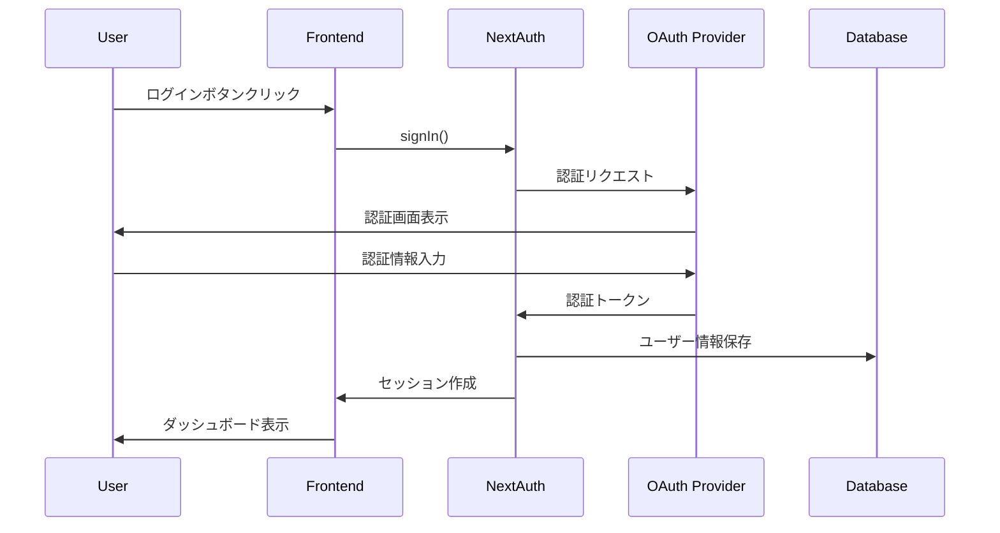

# Authentication & Authorization Guide - LetterOS

## 📚 目次

1. 認証戦略とアーキテクチャ
2. NextAuth.js (Auth.js) セットアップ
3. 認証プロバイダー設定
4. セッション管理
5. 認可（Authorization）パターン
6. APIルート保護
7. セキュリティベストプラクティス
8. 実装例集

## 1. 認証戦略とアーキテクチャ

LetterOSは**NextAuth.js v5 (Auth.js)**を使用し、セキュアで拡張可能な認証システムを実装します。

### 認証フロー



### 技術選定理由

- **NextAuth.js v5**: Next.js App Routerネイティブサポート
- **JWT + Database Session**: ハイブリッド方式でセキュリティとパフォーマンスを両立
- **OAuth 2.0**: Google、GitHub等の外部プロバイダー対応
- **RBAC**: ロールベースアクセス制御

## 2. NextAuth.js (Auth.js) セットアップ

### インストール

```bash
npm install next-auth@beta
npm install @auth/prisma-adapter
```

### 環境変数設定

```bash
# .env
AUTH_SECRET="your-secret-key-generate-with-openssl"
AUTH_URL="http://localhost:3000"

# Google OAuth
AUTH_GOOGLE_ID="your-google-client-id"
AUTH_GOOGLE_SECRET="your-google-client-secret"

# GitHub OAuth
AUTH_GITHUB_ID="your-github-client-id"
AUTH_GITHUB_SECRET="your-github-client-secret"
```

### 秘密鍵の生成

```bash
openssl rand -base64 32
```

## 3. 認証プロバイダー設定

### auth.ts設定ファイル

```typescript
// lib/auth.ts
import NextAuth, { DefaultSession } from 'next-auth';
import Google from 'next-auth/providers/google';
import GitHub from 'next-auth/providers/github';
import Credentials from 'next-auth/providers/credentials';
import { PrismaAdapter } from '@auth/prisma-adapter';
import { db } from '@/lib/db';
import { compare } from 'bcryptjs';
import { z } from 'zod';

// セッション型拡張
declare module 'next-auth' {
  interface Session {
    user: {
      id: string;
      role: 'USER' | 'ADMIN';
    } & DefaultSession['user'];
  }

  interface User {
    role: 'USER' | 'ADMIN';
  }
}

export const { handlers, signIn, signOut, auth } = NextAuth({
  adapter: PrismaAdapter(db),
  session: {
    strategy: 'jwt',
    maxAge: 30 * 24 * 60 * 60, // 30日間
  },
  pages: {
    signIn: '/login',
    error: '/login',
  },
  providers: [
    Google({
      clientId: process.env.AUTH_GOOGLE_ID,
      clientSecret: process.env.AUTH_GOOGLE_SECRET,
      allowDangerousEmailAccountLinking: true,
    }),
    GitHub({
      clientId: process.env.AUTH_GITHUB_ID,
      clientSecret: process.env.AUTH_GITHUB_SECRET,
      allowDangerousEmailAccountLinking: true,
    }),
    Credentials({
      credentials: {
        email: { label: 'Email', type: 'email' },
        password: { label: 'Password', type: 'password' },
      },
      authorize: async (credentials) => {
        const parsedCredentials = z
          .object({
            email: z.string().email(),
            password: z.string().min(6),
          })
          .safeParse(credentials);

        if (!parsedCredentials.success) {
          return null;
        }

        const { email, password } = parsedCredentials.data;

        const user = await db.user.findUnique({
          where: { email },
        });

        if (!user || !user.password) {
          return null;
        }

        const passwordMatch = await compare(password, user.password);

        if (!passwordMatch) {
          return null;
        }

        return {
          id: user.id,
          email: user.email,
          name: user.name,
          role: user.role,
        };
      },
    }),
  ],
  callbacks: {
    async jwt({ token, user, trigger, session }) {
      // 初回ログイン時
      if (user) {
        token.id = user.id;
        token.role = user.role;
      }

      // セッション更新時
      if (trigger === 'update' && session) {
        token.name = session.name;
        token.email = session.email;
      }

      return token;
    },
    async session({ session, token }) {
      if (token) {
        session.user.id = token.id as string;
        session.user.role = token.role as 'USER' | 'ADMIN';
      }
      return session;
    },
  },
});
```

### Route Handlers設定

```typescript
// app/api/auth/[...nextauth]/route.ts
import { handlers } from '@/lib/auth';

export const { GET, POST } = handlers;
```

### Middleware設定

```typescript
// middleware.ts
import { auth } from '@/lib/auth';
import { NextResponse } from 'next/server';

export default auth((req) => {
  const { nextUrl, auth } = req;
  const isLoggedIn = !!auth;

  // 保護されたルート
  const protectedRoutes = ['/dashboard', '/newsletters', '/analytics', '/settings'];
  const isProtectedRoute = protectedRoutes.some((route) =>
    nextUrl.pathname.startsWith(route)
  );

  if (isProtectedRoute && !isLoggedIn) {
    return NextResponse.redirect(new URL('/login', nextUrl));
  }

  // 認証済みユーザーがログインページにアクセス
  if (isLoggedIn && nextUrl.pathname === '/login') {
    return NextResponse.redirect(new URL('/dashboard', nextUrl));
  }

  return NextResponse.next();
});

export const config = {
  matcher: ['/((?!api|_next/static|_next/image|favicon.ico).*)'],
};
```

## 4. セッション管理

### サーバーコンポーネントでのセッション取得

```tsx
// app/(dashboard)/layout.tsx
import { auth } from '@/lib/auth';
import { redirect } from 'next/navigation';

export default async function DashboardLayout({ children }) {
  const session = await auth();

  if (!session) {
    redirect('/login');
  }

  return (
    <div>
      <Header user={session.user} />
      {children}
    </div>
  );
}
```

### クライアントコンポーネントでのセッション利用

```tsx
// components/user-nav.tsx
'use client';

import { useSession } from 'next-auth/react';
import { Avatar, AvatarFallback, AvatarImage } from '@/components/ui/avatar';

export function UserNav() {
  const { data: session, status } = useSession();

  if (status === 'loading') {
    return <div>Loading...</div>;
  }

  if (!session) {
    return null;
  }

  return (
    <div className="flex items-center gap-2">
      <Avatar>
        <AvatarImage src={session.user.image} alt={session.user.name} />
        <AvatarFallback>{session.user.name?.charAt(0)}</AvatarFallback>
      </Avatar>
      <span>{session.user.name}</span>
    </div>
  );
}
```

### SessionProvider設定

```tsx
// components/providers/session-provider.tsx
'use client';

import { SessionProvider } from 'next-auth/react';

export function AuthSessionProvider({ children }: { children: React.ReactNode }) {
  return <SessionProvider>{children}</SessionProvider>;
}

// app/layout.tsx
import { AuthSessionProvider } from '@/components/providers/session-provider';

export default function RootLayout({ children }) {
  return (
    <html lang="ja">
      <body>
        <AuthSessionProvider>
          {children}
        </AuthSessionProvider>
      </body>
    </html>
  );
}
```

## 5. 認可（Authorization）パターン

### ロールベースアクセス制御（RBAC）

```typescript
// lib/authorization.ts
import { auth } from '@/lib/auth';

export type Role = 'USER' | 'ADMIN';

export async function requireAuth(allowedRoles?: Role[]) {
  const session = await auth();

  if (!session?.user) {
    throw new Error('Unauthorized');
  }

  if (allowedRoles && !allowedRoles.includes(session.user.role)) {
    throw new Error('Forbidden');
  }

  return session.user;
}

// 使用例
export async function GET() {
  const user = await requireAuth(['ADMIN']); // ADMIN のみ許可

  // 処理
}
```

### リソースベースアクセス制御

```typescript
// lib/can-access.ts
import { db } from '@/lib/db';
import { auth } from '@/lib/auth';

export async function canAccessNewsletter(newsletterId: string) {
  const session = await auth();

  if (!session?.user) {
    return false;
  }

  const newsletter = await db.newsletter.findUnique({
    where: { id: newsletterId },
    select: { userId: true },
  });

  // 所有者またはADMINのみアクセス可能
  return (
    newsletter?.userId === session.user.id ||
    session.user.role === 'ADMIN'
  );
}

// 使用例
export async function GET(
  request: Request,
  { params }: { params: { id: string } }
) {
  if (!(await canAccessNewsletter(params.id))) {
    return NextResponse.json({ error: 'Forbidden' }, { status: 403 });
  }

  // 処理
}
```

## 6. APIルート保護

### Route Handler保護

```typescript
// app/api/newsletters/route.ts
import { NextRequest, NextResponse } from 'next/server';
import { auth } from '@/lib/auth';
import { db } from '@/lib/db';

export async function GET(request: NextRequest) {
  const session = await auth();

  if (!session?.user) {
    return NextResponse.json({ error: 'Unauthorized' }, { status: 401 });
  }

  const newsletters = await db.newsletter.findMany({
    where: { userId: session.user.id },
  });

  return NextResponse.json({ newsletters });
}
```

### Server Actions保護

```typescript
// app/actions/newsletters.ts
'use server';

import { auth } from '@/lib/auth';
import { db } from '@/lib/db';
import { revalidatePath } from 'next/cache';

export async function createNewsletter(formData: FormData) {
  const session = await auth();

  if (!session?.user) {
    throw new Error('Unauthorized');
  }

  const title = formData.get('title') as string;
  const content = formData.get('content') as string;

  const newsletter = await db.newsletter.create({
    data: {
      title,
      content,
      userId: session.user.id,
    },
  });

  revalidatePath('/newsletters');
  return newsletter;
}
```

## 7. セキュリティベストプラクティス

### CSRF保護

NextAuth.jsは自動的にCSRF保護を提供します。

```typescript
// 自動的に保護される
export const { handlers, signIn, signOut } = NextAuth({
  // デフォルトでCSRFトークンが検証される
});
```

### Rate Limiting

```typescript
// lib/rate-limit.ts
import { LRUCache } from 'lru-cache';

const rateLimitCache = new LRUCache<string, number[]>({
  max: 500,
  ttl: 60000, // 1分
});

export function rateLimit(identifier: string, limit: number = 5) {
  const tokenCount = rateLimitCache.get(identifier) || [0];
  tokenCount[0] += 1;
  rateLimitCache.set(identifier, tokenCount);

  if (tokenCount[0] > limit) {
    throw new Error('Rate limit exceeded');
  }
}

// 使用例
export async function POST(request: NextRequest) {
  const ip = request.ip ?? 'anonymous';

  try {
    rateLimit(ip, 5); // 1分あたり5リクエスト
  } catch {
    return NextResponse.json(
      { error: 'Too many requests' },
      { status: 429 }
    );
  }

  // 処理
}
```

### パスワードハッシング

```typescript
// lib/password.ts
import { hash, compare } from 'bcryptjs';

export async function hashPassword(password: string) {
  return hash(password, 12);
}

export async function verifyPassword(password: string, hashedPassword: string) {
  return compare(password, hashedPassword);
}

// ユーザー登録時
const hashedPassword = await hashPassword(password);
await db.user.create({
  data: {
    email,
    password: hashedPassword,
  },
});
```

## 8. 実装例集

### ログインページ

```tsx
// app/login/page.tsx
import { LoginForm } from '@/components/auth/login-form';

export default function LoginPage() {
  return (
    <div className="flex min-h-screen items-center justify-center">
      <div className="w-full max-w-md space-y-6">
        <div className="text-center">
          <h1 className="text-3xl font-bold">LetterOS</h1>
          <p className="text-gray-600">ログインしてください</p>
        </div>
        <LoginForm />
      </div>
    </div>
  );
}
```

### ログインフォーム

```tsx
// components/auth/login-form.tsx
'use client';

import { signIn } from 'next-auth/react';
import { useRouter } from 'next/navigation';
import { Button } from '@/components/ui/button';
import { FaGoogle, FaGithub } from 'react-icons/fa';

export function LoginForm() {
  const router = useRouter();

  const handleOAuthLogin = async (provider: 'google' | 'github') => {
    await signIn(provider, { redirectTo: '/dashboard' });
  };

  return (
    <div className="space-y-4">
      <Button
        onClick={() => handleOAuthLogin('google')}
        variant="outline"
        className="w-full"
      >
        <FaGoogle className="mr-2" />
        Googleでログイン
      </Button>

      <Button
        onClick={() => handleOAuthLogin('github')}
        variant="outline"
        className="w-full"
      >
        <FaGithub className="mr-2" />
        GitHubでログイン
      </Button>
    </div>
  );
}
```

### ログアウトボタン

```tsx
// components/auth/logout-button.tsx
'use client';

import { signOut } from 'next-auth/react';
import { Button } from '@/components/ui/button';

export function LogoutButton() {
  return (
    <Button
      onClick={() => signOut({ redirectTo: '/login' })}
      variant="ghost"
    >
      ログアウト
    </Button>
  );
}
```

### 認証ガード（高階コンポーネント）

```tsx
// components/auth/auth-guard.tsx
import { auth } from '@/lib/auth';
import { redirect } from 'next/navigation';

export async function AuthGuard({ children }: { children: React.ReactNode }) {
  const session = await auth();

  if (!session) {
    redirect('/login');
  }

  return <>{children}</>;
}

// 使用例
export default function DashboardPage() {
  return (
    <AuthGuard>
      <div>Protected Content</div>
    </AuthGuard>
  );
}
```

## 🌐 参照リソース

### 公式ドキュメント

1. [NextAuth.js Documentation](https://next-auth.js.org/) - NextAuth.js公式
2. [Auth.js v5 Migration](https://authjs.dev/guides/upgrade-to-v5) - v5移行ガイド
3. [OAuth 2.0 Specification](https://oauth.net/2/) - OAuth仕様
4. [OWASP Authentication Cheat Sheet](https://cheatsheetseries.owasp.org/cheatsheets/Authentication_Cheat_Sheet.html) - 認証セキュリティ
5. [JWT Best Practices](https://tools.ietf.org/html/rfc8725) - JWTベストプラクティス

### 実装記事・セキュリティ

6. [NextAuth.js with Prisma](https://authjs.dev/reference/adapter/prisma) - Prisma統合
7. [Secure Authentication in Next.js](https://nextjs.org/docs/app/building-your-application/authentication) - Next.js認証ガイド
8. [Session Management Best Practices](https://cheatsheetseries.owasp.org/cheatsheets/Session_Management_Cheat_Sheet.html) - セッション管理
9. [Password Storage Cheat Sheet](https://cheatsheetseries.owasp.org/cheatsheets/Password_Storage_Cheat_Sheet.html) - パスワード保存
10. [CSRF Protection in Next.js](https://nextjs.org/docs/app/building-your-application/configuring/middleware) - CSRF対策

---

**実装時間目安**: 基本認証実装 1人日、OAuth設定 0.5人日、認可ロジック 1-2人日
