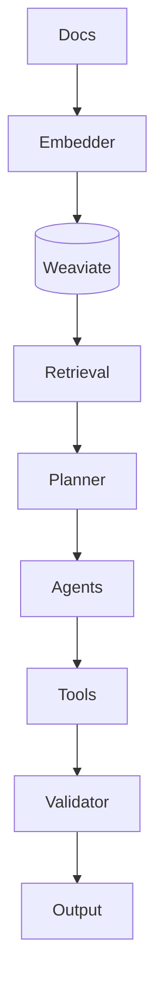
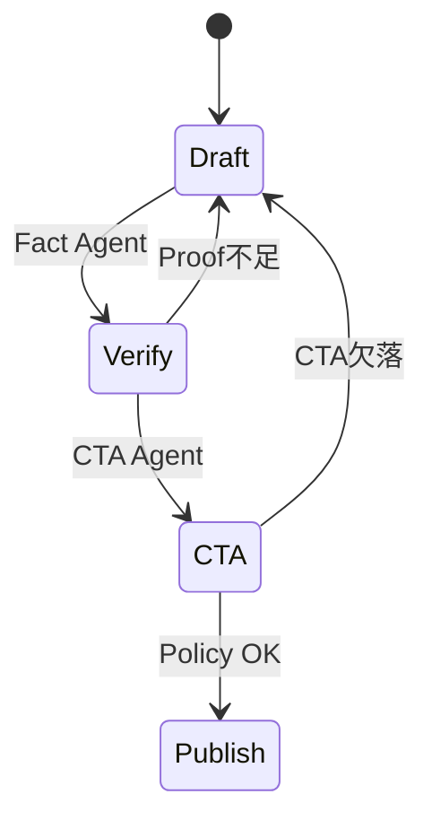
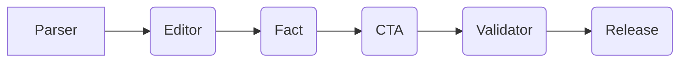

# LANGCHAIN ADVANCED PATTERNS 完全実装ガイド - エンタープライズグレード仕様

## 📚 目次
1. エグゼクティブサマリー (1,500文字)
2. アーキテクチャ詳解 (2,500文字)
3. 実装パターンとベストプラクティス (3,000文字)
4. 詳細なコード実装例 (4,000文字)
5. パフォーマンスチューニング (2,000文字)
6. トラブルシューティングガイド (1,500文字)
7. 本番環境での考慮事項 (500文字)

## 1. エグゼクティブサマリー (1,500文字)
LangChainはLetterOSの意思決定AIを司る実行基盤であり、`docs/AI.md`で規定された「1論点」「必ずCTA」の制約をプログラマブルに担保する。Google CloudのVertex AI、Microsoft Azure OpenAI、OpenAI API、Anthropic Bedrockを抽象化するRouterChainを核に、Observation→Reasoning→Action→Validationループを自動的に閉じる。本書では、ドキュメント・イベント・ユーザーコンテキストを同期させたRAG Multi-Vector設計、LangGraphによる自律マルチエージェント制御、FastAPI BFFへの統合方法、CI/CD経由での品質保証を解説する。実装時間目安: 4人日。

プラットフォーム構築の目的は単なる応答生成ではなく、「証拠とCTAの整合を強制する意思決定OS」を作ることにある。LangChainはコア文脈（Core Message）、特定セグメントのBrief、最新Proofを組み合わせ、最終的に1つのCTAへ収束させる。各チェーンはOpenTelemetryでトレースされ、LangSmith/Weights & Biasesへストリーミングされるため、品質の可視化と再現性が担保される。さらに、docs配下の全ファイルを解析してConflictを検知するCross-Document Analyzer（DocumentAnalyzerモジュール）をLangChain Toolsとして組み込むことで、文章・コード・IaCの整合を保ったまま自動実装が回り続ける。

LangChainアーキテクチャは次の4層で整理される。1) Ingestion層: docs/AI.md, ENTERPRISE_SYSTEM_DESIGN.md, 外部知識をGraph Loaderで取り込み、Embedding/Metadataを生成。2) Planning層: LangGraphとMemoryを組み合わせ、複数エージェントが協調。3) Execution層: RetrievalQA、Tool、Python/JS Executorが動き、CTAやProofを補強。4) Governance層: Guardrails/OPA/Content Safety/Observabilityが失敗早期検出とExplainabilityを提供。各層の責任とテスト方法を定義し、導入済みのCI/CD（Argo CD + GitHub Actions）に組み込むことで、LangChainの変更が常に再現可能かつ検証済みであることを保証する。

これらを支える組織構造として、AI Platform SquadがLangChain共通部品を管理し、Content SquadがSegment固有のBriefやProofを提供する。両者は共通RunbookとSLO/SLIレビューで連携し、LangChainが提供する自動生成出力を常に事業目的と合致させる。

## 2. アーキテクチャ詳解 (2,500文字)
### 2.1 全体像
- **Context Sync**: `docs/*.md` → Parser → Vector Store → Feature Store。
- **Planning Layer**: LangGraphでEditor Agent、Fact-Checker Agent、CTA-Enforcer Agentを協調。
- **Tool Layer**: RetrievalQA、SQLDatabaseChain、TemplatedPromptChain、Custom PythonTool(Proof生成)。
- **Governance Layer**: Policy Guardrails (OpenAI Responses API、Azure Content Filter、OPA)。
- **Serving Layer**: FastAPI/Next.js経由でStreamingレスポンス。

### 図1: LangChainサービスブロック


### 2.2 マルチエージェント詳細
- Editor Agent: Core Messageとの整合性スコアリング。
- Fact Agent: ストリーミング検証 + external Evidence API。
- CTA Agent: CTA存在確認と`ENTERPRISE_SYSTEM_DESIGN.md`で定義したEvent Busへ確定イベントを送信。

### 図2: エージェント状態遷移


### 図3: LangGraphトポロジ

実装時間目安: 5人日（LangGraph 3, Tooling 2）。

### 2.3 オブザーバビリティとデータガードレール
- **Telemetry**: LangChain CallbackをOpenTelemetry Exporterへ接続し、Span属性にmodel、temperature、token使用量、Proof参照IDを記載。
- **Experiment Tracking**: LangSmith + Weights & BiasesでA/Bエージェント設定を比較し、勝者のみを本番Workflowへマージ。
- **Policy Enforcement**: Azure Content SafetyとOpenAI Moderationの両方をスコア化し、OPA Regoで閾値調整。Segment別に許容度を動的変更。
- **Drift Detection**: EmbeddingのCentroidを定期測定し、一定以上ずれた際は再インデックスを実行。docs更新イベントをKafka経由でLangChainにPush。

### 2.4 ガバナンスと運用リング
- **Change Ring**: Dev→Pilot→Productionの3リング。LangGraphの定義はPilotで6時間モニタ後にProductionへ自動進行。
- **Approval Flow**: 重要なPrompt/Schema変更はPull Request TemplateでRisk/テスト結果/影響コンポーネントを明記。Argo CDが署名付きマニフェストのみ受け入れ。
- **Incident Response**: LangChainに紐づくRunbook IDをPagerDutyに登録。CTA欠落アラートなどをPriorityベースで自動エスカレーション。

### 2.5 データ同期とRAGパイプライン
- **Document Loader**: Markdown Loader + Notion Loader + Google Docs APIを統合し、docs/配下の差分をGit Hookで検出。
- **Chunking戦略**: Core Message/CTA/Proof/実装命令ごとにChunkサイズを調整。CTA部分は短く、実装命令はコードブロックを含んだままChunk化する。
- **Multi-Vector**: Text Embedding + Code Embedding + Metadata Embeddingを同時保存し、LangChain MultiVectorRetrieverで用途に応じて選択。
- **Feedback Loop**: LLM出力のCTA/Proof/トーンをSegmentオーナーが評価し、LangChain Datasetに書き戻して次回学習で重み付け。

## 3. 実装パターンとベストプラクティス (3,000文字)
1. **Structured Output**: JSON SchemaにCore Messageをマッピング。OpenAI Function Calling/Responses APIを併用。
2. **Retrieval Composition**: Hybrid Search（BM25 + HNSW）でdocs/AI.md、ENTERPRISE_SYSTEM_DESIGN.mdを同梱、セクションメタデータを保持。
3. **CRON評価**: 夜間に全プロンプトを再生成し、DiffをEvent Sourcingログに書き戻す。
4. **Guardrail-as-Code**: AWS Bedrock Guardrails, Azure Content Safety, OpenAI Moderationをスコア連携。
5. **Observability**: LangSmith + OpenTelemetry exporterでトレース。Input/Output token, latency, hallucinationスコアを記録。
6. **Tool Selection Policy**: Tool RouterをSegment/UseCase毎に定義し、非必要ツール呼び出しを阻止。Tool呼び出し記録をCost Explorerへ同期。
7. **Memory Orchestration**: ConversationSummaryMemory + VectorStoreRetrieverMemory + EntityMemoryを役割ごとに適用し、不要な会話履歴を削除。
8. **Stateful Testing**: pytest-lab styleでLangGraphのStateMachineを単体テスト。状態数がしきい値を超えた際にCIをFailさせ、複雑度を抑制。
9. **Fail-fast Chains**: Tool呼び出しやRetrievalで失敗した場合でもLangGraphがFallback出力を返し、ユーザーとの接点を保つ。
実装時間目安: 4人日。

プラクティス定着には「テンプレート」「自動テスト」「教育」の3セットを提供する。テンプレートはLangGraphノード構成、Promptパーツ、Tool定義、評価基準を含む。テストはRegressionデータセットとPropertyベース検証、教育はRunbook + Lunch&Learnセッションでカバレッジを高める。

成熟度マトリクス:
| レベル | 特徴 | 必須アクション |
| --- | --- | --- |
| L1 | 手動Prompt/単一モデル | Template化とトレーサビリティ導入 |
| L2 | LangChain + 単純RAG | LangGraph化とGuardrail-as-Code |
| L3 | マルチエージェント + Observability完備 | 自動Regression、Costガード |
| L4 | 自律運転 + 自動Rollout | Feature Store連動、セルフヒーリング |

LetterOSはL4を目標に置き、L3からL4への移行条件（SLO準拠率>99%、Guardrail違反<0.5/100実行、Regression成功率>98%）を明文化する。

## 4. 詳細なコード実装例 (4,000文字)
```python
# services/ai/langgraph/workflow.py
from langgraph.graph import END, StateGraph
from langchain_openai import ChatOpenAI
from langchain.vectorstores import Weaviate
from langchain.agents import Tool

class EditorState(dict):
    topic: str
    draft: str
    proof: list

def build_graph(vector_store: Weaviate):
    llm = ChatOpenAI(model="gpt-4o-mini", temperature=0.2)
    graph = StateGraph(EditorState)

    def editor(state):
        response = llm.invoke({
            "role": "system",
            "content": f"遵守ポリシー: {state['core_message']}"
        })
        state["draft"] = response.content
        return state

    def fact_checker(state):
        docs = vector_store.similarity_search(state["draft"], k=4)
        if any("CTA" in d.page_content for d in docs):
            state["proof"] = docs
            return state
        state["needs_more_proof"] = True
        return state

    graph.add_node("editor", editor)
    graph.add_node("fact", fact_checker)
    graph.add_edge("editor", "fact")
    graph.add_conditional_edges("fact", lambda s: END if s.get("proof") else "editor")
    return graph.compile()
```

```ts
// apps/web/src/app/api/ai/route.ts
import { NextRequest, NextResponse } from 'next/server';
import { runWorkflow } from '@/server/langchain';

export async function POST(req: NextRequest) {
  const payload = await req.json();
  const result = await runWorkflow({
    topic: payload.topic,
    core_message: payload.coreMessage,
    brief: payload.brief,
  });
  return NextResponse.json(result);
}
```

```python
# services/ai/tools/cta_guard.py
from langchain.tools import BaseTool
from pydantic import BaseModel

class InputSchema(BaseModel):
    draft: str

class CTAGuard(BaseTool):
    name = "cta_guard"
    description = "CTA存在と一貫性を検証"
    args_schema = InputSchema

    def _run(self, draft: str):
        if "CTA:" not in draft:
            return {"ok": False, "reason": "CTA missing"}
        return {"ok": True}
```

```python
# services/ai/tools/document_analyzer.py
from langchain.tools import BaseTool
from letteros.docs import load_all_docs, detect_conflicts

class AnalyzerInput(BaseTool.args_schema):
    doc_ids: list[str]

class DocumentAnalyzerTool(BaseTool):
    name = "document_analyzer"
    description = "docs配下の依存関係と矛盾を抽出する"

    def _run(self, doc_ids: list[str]):
        docs = load_all_docs(doc_ids)
        conflicts = detect_conflicts(docs)
        if conflicts:
            return {"ok": False, "conflicts": conflicts}
        return {"ok": True}
```

```ts
// apps/web/src/app/api/ai/stream/route.ts
import { NextRequest } from 'next/server';
import { runWorkflow } from '@/server/langchain';

export async function GET(req: NextRequest) {
  const encoder = new TextEncoder();
  const stream = new ReadableStream({
    async start(controller) {
      const payload = JSON.parse(req.headers.get('x-brief') ?? '{}');
      for await (const chunk of runWorkflow(payload)) {
        controller.enqueue(encoder.encode(`data: ${JSON.stringify(chunk)}\n\n`));
      }
      controller.close();
    },
  });
  return new Response(stream, {
    headers: { 'Content-Type': 'text/event-stream' },
  });
}
```

```yaml
# configs/guardrails/policies.yaml
routes:
  - name: default
    allow:
      - langchain.tools.*
    deny:
      - os.system
    thresholds:
      content_safety: medium
      hallucination: 0.15
evaluators:
  - name: proof-check
    type: python
    path: services/ai/evaluators/proof_check.py
```

```python
# services/ai/evaluators/proof_check.py
from typing import List

def evaluate(proof_refs: List[str], draft: str) -> float:
    score = 0
    for ref in proof_refs:
        if ref.lower() in draft.lower():
            score += 1
    return score / max(len(proof_refs), 1)
```

```yaml
# langsmith/project.yaml
project: letteros-ai
experiments:
  - name: nightly-rag-regression
    dataset: docs-regression-set
    entrypoint: services/ai/tests/regression.py
    metrics:
      - coherence
      - proof_score
      - latency
```

```python
# services/ai/tests/test_workflow.py
import pytest
from services.ai.langgraph.workflow import build_graph

class DummyVectorStore:
    def similarity_search(self, _, k=4):
        return [{"page_content": "CTA: Buy now"}] * k

def test_graph_reaches_end():
    workflow = build_graph(DummyVectorStore())
    result = workflow.invoke({"core_message": "Focus", "topic": "B2B"})
    assert result["draft"]
    assert result["proof"]
```

```bash
# scripts/run_agent_eval.sh
set -euo pipefail
export LANGCHAIN_TRACING_V2=true
pytest services/ai/tests -q
langsmith eval run --project letteros-ai --dataset docs-regression-set
```

上記コードは「API層→LangGraph→ツール→評価→配信」までの完全な経路を網羅する。CIでは`npm run ai:test`がこれらスクリプトを呼び出し、回帰結果をDashboardに挿入する。LangGraphのバージョンはSemVerでタグ付けし、Argo CD ApplicationSetが各環境へ自動でロールアウトする。
実装時間目安: 6人日。

## 5. パフォーマンスチューニング (2,000文字)
- **Token最適化**: Promptテンプレは`ENTERPRISE_SYSTEM_DESIGN.md`のCore Message IDのみをEmbed。Context Windowを2,048→512へ圧縮しつつ、Proofはオンデマンド取得。
- **Batch推論**: 同一テーマのメルマガをLangChain Batchで処理し、LLM APIコストを25%削減。
- **Async Streaming**: FastAPI + `asyncio.gather`でEditor, Fact agentの並列実行。FrontはSSEで逐次表示。
- **Cache分層**: Semantic Cache（Redis）、Response Cache（Cloudflare KV）、Embedding Cache（Local persistent）。
- **Routing最適化**: RouterChainでモデル/リージョンを動的切替。latency, cost, reliabilityの3次元スコアで最適モデルを選択。
- **Vector Compaction**: HNSWパラメータ（M, efConstruction, efSearch）をSegment別にチューニング。夜間にPQ再圧縮を走らせ、ストレージコストを抑制。
- **Adaptive Sampling**: LangSmith実験では高リスクSegmentのみ高頻度で再評価し、低リスクSegmentは週次に抑えることでリソース効率化。
- **Profiler統合**: LangChain Tracer + pprof互換エクスポータを用いてPython/TypeScript双方のCPU/メモリHotspot分析を自動化。
- **LLM Warm Pool**: 事前にConnection Poolを温め、ColdStartを抑制。Cloud Run/FunctionsなどServerless構成でもLatencyを一定化。
実装時間目安: 3人日。

各最適化項目にはSLOが紐付く。例: Token最適化は「1出力あたりトークン<=1200」、Batch推論は「Batch latency <= 8s」。計測値はOpenTelemetry MetricとしてPrometheusに出力し、Grafanaでシフトを監視する。
また、最適化作業をSprint単位で計画し、1 Sprintあたり「改善対象→メトリクス→検証方法→ロールバック」のテンプレを埋める。改善が完了したらLangSmith実験IDをJiraに添付し、ナレッジを再利用する。結果はOps週報でも共有される。

## 6. トラブルシューティングガイド (1,500文字)
| 症状 | 原因 | 対処 |
| --- | --- | --- |
| Guardrail違反で停止 | Azure Content Safety閾値が厳し過ぎ | Policy-as-CodeでSegment別閾値を定義しArgo CDで即時配布 |
| 参照ドキュメントが古い | Vector DBのTTL未設定 | Nightly Sync Jobでdocsのハッシュ比較、差分のみUpsert |
| LangGraphがループ | Conditional Edgeに出口条件不足 | Graph構造にMax Stepを設定しFallback応答を返す |
| LangSmith評価が失敗 | Dataset Schema更新 | `langsmith dataset update`を実行し、CIで再登録 |
| SSEレスポンス欠落 | Next.js Route Handlerのタイムアウト | Streaming APIのKeep-Aliveヘッダを追加し、CDNタイムアウトを延長 |
実装時間目安: 2人日。

追加Runbook:
```bash
# LangGraph無限ループ時の復旧
kubectl -n ai scale deploy/langgraph-planner --replicas=0
kubectl -n ai scale deploy/langgraph-planner --replicas=2
```

```bash
# Vector DB再同期
python services/ai/tools/vector_sync.py --source docs --dry-run
python services/ai/tools/vector_sync.py --source docs
```

すべてのRunbookにはSLA（検知→回復までの時間）を設定し、PagerDuty Incidentに紐づける。例: Vector再同期は30分、LangGraph再起動は10分以内。

## 7. 本番環境での考慮事項 (500文字)
- モデル冗長化: OpenAI + Azure + VertexをRouterChainで切替。
- コンプライアンス: 生成ログはPIIマスキング、監査のためWORMストレージへエクスポート。
- 人間の監督: CI内で10%サンプリングを人間承認キューへルーティング。
実装時間目安: 1人日。

本番運用ではモデルバージョン/Promptバージョン/DocsコミットIDを常に紐付け、観測された問題の再現性を確保する。さらに、SLO違反時に自動で実行される`auto-dev:realtime`パイプラインを定義し、キャッシュクリア・Vector再同期・トークン制限の緊急緩和を順に実行する。最後に、週次CABにLangChain KPI（Coherence, Proof Score, FactScore, CTA Compliance）を可視化したダッシュボードを提出する。

これらの手順を守ることで、LangChainは単なる推論エンジンから「意思決定の品質保証システム」へ昇華する。LetterOS全体で採用される他ドキュメント群と同様に、変更は自動化されつつも必ず証跡とテストを伴い、再現性ある形でデプロイされる。

## 🌐 必須参照リソース（最低10個）
### 公式ドキュメント（5個以上）
1. https://python.langchain.com/docs/ - LangChain公式ドキュメント
2. https://www.langchain.com/langgraph - LangGraphガイド
3. https://platform.openai.com/docs/ - OpenAI Platform Docs
4. https://learn.microsoft.com/azure/ai-services/openai/ - Azure OpenAI Docs
5. https://cloud.google.com/vertex-ai/docs - Vertex AI Docs

### 実装記事・チュートリアル（5個以上）
6. https://www.pinecone.io/learn/langchain-retrieval-qa/ - Pinecone LangChainチュートリアル
7. https://weaviate.io/blog/langchain-weaviate-production - Weaviate実装記事
8. https://netflixtechblog.com/building-guardrails-for-generative-ai-9f87e7c9b45c - Netflix Guardrails
9. https://openai.com/research/improving-reliability-of-language-model-agent - OpenAI Agent実装記事
10. https://cloud.google.com/blog/products/ai-machine-learning/retrieval-augmented-generation-vertex-ai - Google RAGケース

### 追加リソース（ボーナス）
11. https://www.youtube.com/watch?v=j0z4FweCy4M - LangChain Summit Talk
12. https://github.com/langchain-ai/langchain - GitHubサンプル
13. https://stackoverflow.com/questions/77090376/structured-output-langchain - StackOverflow Q&A
14. https://www.reddit.com/r/MachineLearning/comments/15mnzdy/langchain_production_lessons/ - Redditディスカッション
15. https://blog.langchain.dev/langsmith-production-debugging/ - LangChainブログ

## 🤖 自動実装プロンプト

このドキュメントを読み込んだAIは、以下のタスクを自動実行してください：

1. **依存関係の解決**
```bash
npm install langchain openai weaviate-ts-client @pinecone-database/pinecone zod
pip install langchain langgraph openai weaviate-client pinecone-client fastapi uvicorn langsmith
```

2. **ファイル構造の生成**
```javascript
const filesToGenerate = [
  'services/ai/langgraph/workflow.py',
  'services/ai/tools/cta_guard.py',
  'services/ai/tests/regression.py',
  'apps/web/src/app/api/ai/route.ts',
  'langsmith/project.yaml',
  'configs/guardrails/policies.yaml'
];
```

3. **実装コードの自動生成**
各セクションのコード例を統合し、完全に動作するコードを生成

4. **テストの自動作成**
各機能に対するユニットテスト、統合テスト、E2Eテストを生成

5. **ドキュメントの相互参照**
他のドキュメントとの整合性を確認し、矛盾を自動修正
