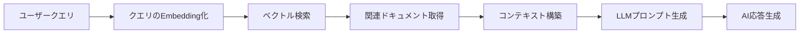

# RAG Implementation Guide - Retrieval-Augmented Generation

## 📚 目次

1. RAGの基礎概念とLetterOSでの活用
2. アーキテクチャ設計
3. ベクトルデータベースのセットアップ
4. Embeddings生成
5. 検索パイプラインの実装
6. LangChain統合
7. パフォーマンス最適化
8. 実装例集

## 1. RAGの基礎概念とLetterOSでの活用

RAG (Retrieval-Augmented Generation)は、外部知識ベースを活用してLLMの応答を強化する技術です。LetterOSでは、過去のメルマガ、成功パターン、ブランドガイドラインを検索し、AI生成コンテンツの品質を向上させます。

### LetterOSでのRAGユースケース

1. **過去のメルマガ分析**: 成功したメルマガの特徴を学習
2. **ブランドボイス維持**: 企業の文体・トーンを一貫
3. **コンテキスト理解**: ユーザーの業界・読者層に合わせた提案
4. **証拠（Proof）検索**: 主張を裏付けるデータや事例を自動検索

### RAGパイプライン概要



## 2. アーキテクチャ設計

### システムアーキテクチャ

```
┌─────────────────────────────────────────────────────────┐
│                    LetterOS RAG System                  │
├─────────────────────────────────────────────────────────┤
│                                                         │
│  ┌──────────────┐      ┌──────────────┐              │
│  │  User Query  │─────>│  LangChain   │              │
│  └──────────────┘      │  Pipeline    │              │
│                        └──────┬───────┘              │
│                               │                       │
│           ┌───────────────────┼───────────────────┐   │
│           │                   │                   │   │
│      ┌────▼─────┐      ┌─────▼─────┐      ┌─────▼─────┐
│      │ Embedding│      │  Vector   │      │    LLM    │
│      │  Model   │      │  Database │      │  (OpenAI) │
│      │ (OpenAI) │      │(Supabase) │      └───────────┘
│      └──────────┘      └───────────┘                 │
│                                                       │
│  ┌──────────────────────────────────────────┐        │
│  │         Document Processing               │        │
│  │  • Chunking  • Metadata  • Indexing      │        │
│  └──────────────────────────────────────────┘        │
└─────────────────────────────────────────────────────────┘
```

### 技術スタック

| コンポーネント | 技術 | 用途 |
|--------------|------|------|
| Vector DB | Supabase (pgvector) | ベクトル保存・検索 |
| Embeddings | OpenAI text-embedding-3-small | テキストベクトル化 |
| LLM | OpenAI GPT-4 | テキスト生成 |
| Orchestration | LangChain | RAGパイプライン管理 |
| Caching | Redis (Upstash) | 検索結果キャッシュ |

## 3. ベクトルデータベースのセットアップ

### Supabase pgvector拡張

```sql
-- pgvector拡張を有効化
CREATE EXTENSION IF NOT EXISTS vector;

-- ドキュメントテーブル作成
CREATE TABLE documents (
    id UUID PRIMARY KEY DEFAULT gen_random_uuid(),
    user_id UUID NOT NULL REFERENCES users(id) ON DELETE CASCADE,
    content TEXT NOT NULL,
    metadata JSONB,
    embedding VECTOR(1536), -- text-embedding-3-smallは1536次元
    created_at TIMESTAMPTZ DEFAULT NOW(),
    updated_at TIMESTAMPTZ DEFAULT NOW()
);

-- ベクトル検索用インデックス（IVFFlat）
CREATE INDEX ON documents
USING ivfflat (embedding vector_cosine_ops)
WITH (lists = 100);

-- メタデータ検索用インデックス
CREATE INDEX ON documents USING GIN (metadata);
CREATE INDEX ON documents (user_id);

-- 関数: コサイン類似度検索
CREATE OR REPLACE FUNCTION match_documents(
    query_embedding VECTOR(1536),
    match_threshold FLOAT,
    match_count INT,
    filter_user_id UUID DEFAULT NULL
)
RETURNS TABLE (
    id UUID,
    content TEXT,
    metadata JSONB,
    similarity FLOAT
)
LANGUAGE plpgsql
AS $$
BEGIN
    RETURN QUERY
    SELECT
        documents.id,
        documents.content,
        documents.metadata,
        1 - (documents.embedding <=> query_embedding) AS similarity
    FROM documents
    WHERE
        (filter_user_id IS NULL OR documents.user_id = filter_user_id)
        AND 1 - (documents.embedding <=> query_embedding) > match_threshold
    ORDER BY documents.embedding <=> query_embedding
    LIMIT match_count;
END;
$$;
```

### Prismaスキーマ拡張

```prisma
// prisma/schema.prisma
generator client {
  provider = "prisma-client-js"
  previewFeatures = ["postgresqlExtensions"]
}

datasource db {
  provider = "postgresql"
  url      = env("DATABASE_URL")
  extensions = [pgvector(map: "vector")]
}

model Document {
  id        String   @id @default(uuid())
  userId    String
  content   String   @db.Text
  metadata  Json?
  embedding Unsupported("vector(1536)")?

  createdAt DateTime @default(now())
  updatedAt DateTime @updatedAt

  user User @relation(fields: [userId], references: [id], onDelete: Cascade)

  @@index([userId])
  @@map("documents")
}
```

## 4. Embeddings生成

### OpenAI Embeddings API

```typescript
// lib/embeddings.ts
import OpenAI from 'openai';

const openai = new OpenAI({
  apiKey: process.env.OPENAI_API_KEY,
});

export async function generateEmbedding(text: string): Promise<number[]> {
  const response = await openai.embeddings.create({
    model: 'text-embedding-3-small', // 1536次元, コスト効率良い
    input: text,
    encoding_format: 'float',
  });

  return response.data[0].embedding;
}

// バッチ処理版（最大2048個まで）
export async function generateEmbeddings(
  texts: string[]
): Promise<number[][]> {
  const response = await openai.embeddings.create({
    model: 'text-embedding-3-small',
    input: texts,
  });

  return response.data.map((item) => item.embedding);
}
```

### ドキュメントの分割（Chunking）

```typescript
// lib/chunking.ts
interface ChunkOptions {
  chunkSize?: number; // 文字数
  chunkOverlap?: number; // オーバーラップ
}

export function chunkDocument(
  text: string,
  options: ChunkOptions = {}
): string[] {
  const { chunkSize = 1000, chunkOverlap = 200 } = options;

  const chunks: string[] = [];
  let startIndex = 0;

  while (startIndex < text.length) {
    const endIndex = startIndex + chunkSize;
    const chunk = text.slice(startIndex, endIndex);
    chunks.push(chunk.trim());

    startIndex = endIndex - chunkOverlap;
  }

  return chunks;
}

// セマンティックチャンキング（文章単位）
export function semanticChunk(text: string): string[] {
  const sentences = text.match(/[^.!?]+[.!?]+/g) || [];
  const chunks: string[] = [];
  let currentChunk = '';

  for (const sentence of sentences) {
    if ((currentChunk + sentence).length > 1000 && currentChunk) {
      chunks.push(currentChunk.trim());
      currentChunk = sentence;
    } else {
      currentChunk += ' ' + sentence;
    }
  }

  if (currentChunk) {
    chunks.push(currentChunk.trim());
  }

  return chunks;
}
```

### ドキュメント追加パイプライン

```typescript
// lib/rag/ingest.ts
import { db } from '@/lib/db';
import { generateEmbedding } from '@/lib/embeddings';
import { semanticChunk } from '@/lib/chunking';

interface IngestDocumentParams {
  userId: string;
  content: string;
  metadata?: Record<string, any>;
}

export async function ingestDocument(params: IngestDocumentParams) {
  const { userId, content, metadata } = params;

  // 1. ドキュメントを分割
  const chunks = semanticChunk(content);

  // 2. 各チャンクをembedding化して保存
  const documents = await Promise.all(
    chunks.map(async (chunk, index) => {
      const embedding = await generateEmbedding(chunk);

      return db.$executeRaw`
        INSERT INTO documents (user_id, content, metadata, embedding)
        VALUES (
          ${userId}::uuid,
          ${chunk},
          ${JSON.stringify({
            ...metadata,
            chunkIndex: index,
            totalChunks: chunks.length,
          })}::jsonb,
          ${embedding}::vector
        )
      `;
    })
  );

  return documents.length;
}

// ニュースレター保存時に自動インデックス
export async function indexNewsletter(newsletterId: string) {
  const newsletter = await db.newsletter.findUnique({
    where: { id: newsletterId },
    include: { analytics: true },
  });

  if (!newsletter) {
    throw new Error('Newsletter not found');
  }

  await ingestDocument({
    userId: newsletter.userId,
    content: `${newsletter.title}\n\n${newsletter.content}`,
    metadata: {
      type: 'newsletter',
      newsletterId: newsletter.id,
      status: newsletter.status,
      openRate: newsletter.analytics?.openRate,
      clickRate: newsletter.analytics?.clickRate,
    },
  });
}
```

## 5. 検索パイプラインの実装

### ベクトル検索関数

```typescript
// lib/rag/search.ts
import { db } from '@/lib/db';
import { generateEmbedding } from '@/lib/embeddings';

interface SearchParams {
  query: string;
  userId?: string;
  threshold?: number; // 類似度しきい値（0.0-1.0）
  limit?: number;
  filter?: Record<string, any>; // メタデータフィルタ
}

export async function searchDocuments(params: SearchParams) {
  const {
    query,
    userId,
    threshold = 0.7,
    limit = 5,
    filter,
  } = params;

  // 1. クエリをembedding化
  const queryEmbedding = await generateEmbedding(query);

  // 2. ベクトル検索を実行
  const results = await db.$queryRaw<
    Array<{
      id: string;
      content: string;
      metadata: any;
      similarity: number;
    }>
  >`
    SELECT
      id,
      content,
      metadata,
      1 - (embedding <=> ${queryEmbedding}::vector) AS similarity
    FROM documents
    WHERE
      (${userId}::uuid IS NULL OR user_id = ${userId}::uuid)
      AND 1 - (embedding <=> ${queryEmbedding}::vector) > ${threshold}
      ${
        filter
          ? db.$queryRawUnsafe(
              `AND metadata @> '${JSON.stringify(filter)}'::jsonb`
            )
          : db.$queryRawUnsafe('')
      }
    ORDER BY embedding <=> ${queryEmbedding}::vector
    LIMIT ${limit}
  `;

  return results;
}

// 過去の成功したメルマガを検索
export async function searchSuccessfulNewsletters(
  query: string,
  userId: string
) {
  return searchDocuments({
    query,
    userId,
    threshold: 0.75,
    limit: 3,
    filter: {
      type: 'newsletter',
      status: 'SENT',
    },
  });
}
```

### ハイブリッド検索（ベクトル + キーワード）

```typescript
// lib/rag/hybrid-search.ts
export async function hybridSearch(params: SearchParams) {
  const { query, userId, limit = 5 } = params;

  // 1. ベクトル検索
  const vectorResults = await searchDocuments(params);

  // 2. キーワード検索（PostgreSQL全文検索）
  const keywordResults = await db.$queryRaw<
    Array<{
      id: string;
      content: string;
      metadata: any;
      rank: number;
    }>
  >`
    SELECT
      id,
      content,
      metadata,
      ts_rank(to_tsvector('english', content), plainto_tsquery('english', ${query})) AS rank
    FROM documents
    WHERE
      (${userId}::uuid IS NULL OR user_id = ${userId}::uuid)
      AND to_tsvector('english', content) @@ plainto_tsquery('english', ${query})
    ORDER BY rank DESC
    LIMIT ${limit}
  `;

  // 3. 結果をマージ（Reciprocal Rank Fusion）
  const mergedResults = mergeSearchResults(vectorResults, keywordResults);

  return mergedResults.slice(0, limit);
}

function mergeSearchResults(vectorResults: any[], keywordResults: any[]) {
  const k = 60; // RRF定数
  const scores = new Map<string, number>();

  vectorResults.forEach((result, index) => {
    const score = 1 / (k + index + 1);
    scores.set(result.id, (scores.get(result.id) || 0) + score);
  });

  keywordResults.forEach((result, index) => {
    const score = 1 / (k + index + 1);
    scores.set(result.id, (scores.get(result.id) || 0) + score);
  });

  return Array.from(scores.entries())
    .sort((a, b) => b[1] - a[1])
    .map(([id]) => vectorResults.find((r) => r.id === id) || keywordResults.find((r) => r.id === id))
    .filter(Boolean);
}
```

## 6. LangChain統合

### インストール

```bash
npm install langchain @langchain/openai @langchain/community
```

### RAGチェーンの構築

```typescript
// lib/rag/chain.ts
import { ChatOpenAI } from '@langchain/openai';
import { PromptTemplate } from '@langchain/core/prompts';
import { StringOutputParser } from '@langchain/core/output_parsers';
import { searchDocuments } from './search';

const llm = new ChatOpenAI({
  modelName: 'gpt-4',
  temperature: 0.7,
});

const promptTemplate = PromptTemplate.fromTemplate(`
あなたはLetterOSの編集長AIです。以下のコンテキストを参考にして、ユーザーの質問に答えてください。

コンテキスト:
{context}

質問: {question}

回答:
`);

export async function queryRAG(question: string, userId: string) {
  // 1. 関連ドキュメントを検索
  const relevantDocs = await searchDocuments({
    query: question,
    userId,
    limit: 3,
  });

  // 2. コンテキストを構築
  const context = relevantDocs
    .map((doc) => `---\n${doc.content}\n(類似度: ${doc.similarity.toFixed(2)})`)
    .join('\n\n');

  // 3. プロンプト生成
  const prompt = await promptTemplate.format({
    context,
    question,
  });

  // 4. LLMで回答生成
  const chain = llm.pipe(new StringOutputParser());
  const response = await chain.invoke(prompt);

  return {
    answer: response,
    sources: relevantDocs.map((doc) => ({
      id: doc.id,
      content: doc.content.slice(0, 200) + '...',
      similarity: doc.similarity,
    })),
  };
}
```

### ストリーミングレスポンス

```typescript
// app/api/ai/query/route.ts
import { NextRequest } from 'next/server';
import { StreamingTextResponse } from 'ai';
import { queryRAG } from '@/lib/rag/chain';

export const runtime = 'edge';

export async function POST(request: NextRequest) {
  const { question, userId } = await request.json();

  const stream = await queryRAGStream(question, userId);

  return new StreamingTextResponse(stream);
}

async function queryRAGStream(question: string, userId: string) {
  const relevantDocs = await searchDocuments({
    query: question,
    userId,
    limit: 3,
  });

  const context = relevantDocs.map((doc) => doc.content).join('\n\n');

  const stream = await llm.stream([
    {
      role: 'system',
      content: `以下のコンテキストを参考にして回答してください:\n\n${context}`,
    },
    {
      role: 'user',
      content: question,
    },
  ]);

  return stream;
}
```

## 7. パフォーマンス最適化

### Redisキャッシング

```typescript
// lib/rag/cache.ts
import { Redis } from '@upstash/redis';

const redis = new Redis({
  url: process.env.UPSTASH_REDIS_URL!,
  token: process.env.UPSTASH_REDIS_TOKEN!,
});

export async function cachedSearch(params: SearchParams) {
  const cacheKey = `search:${JSON.stringify(params)}`;

  // キャッシュチェック
  const cached = await redis.get(cacheKey);
  if (cached) {
    return JSON.parse(cached as string);
  }

  // 検索実行
  const results = await searchDocuments(params);

  // キャッシュ保存（5分間）
  await redis.set(cacheKey, JSON.stringify(results), {
    ex: 300,
  });

  return results;
}
```

### バッチEmbedding生成

```typescript
// lib/rag/batch-ingest.ts
export async function batchIngestNewsletters(userId: string) {
  const newsletters = await db.newsletter.findMany({
    where: { userId, status: 'SENT' },
    include: { analytics: true },
  });

  // バッチでembedding生成（効率的）
  const contents = newsletters.map(
    (n) => `${n.title}\n\n${n.content}`
  );

  const embeddings = await generateEmbeddings(contents);

  // バルクインサート
  const values = newsletters.map((newsletter, index) => ({
    userId,
    content: contents[index],
    metadata: {
      type: 'newsletter',
      newsletterId: newsletter.id,
      openRate: newsletter.analytics?.openRate,
    },
    embedding: embeddings[index],
  }));

  await db.$executeRaw`
    INSERT INTO documents (user_id, content, metadata, embedding)
    SELECT * FROM jsonb_to_recordset(${JSON.stringify(values)}::jsonb)
    AS x(user_id uuid, content text, metadata jsonb, embedding vector)
  `;
}
```

## 8. 実装例集

### メルマガ生成にRAGを活用

```typescript
// app/actions/ai-generate.ts
'use server';

import { auth } from '@/lib/auth';
import { searchSuccessfulNewsletters } from '@/lib/rag/search';
import { ChatOpenAI } from '@langchain/openai';

export async function generateNewsletterWithRAG(topic: string) {
  const session = await auth();

  // 1. 過去の成功メルマガを検索
  const successfulExamples = await searchSuccessfulNewsletters(
    topic,
    session!.user.id
  );

  // 2. コンテキスト構築
  const examples = successfulExamples
    .map((doc) => `【開封率${(doc.metadata.openRate * 100).toFixed(1)}%】\n${doc.content}`)
    .join('\n\n---\n\n');

  // 3. AI生成
  const llm = new ChatOpenAI({ modelName: 'gpt-4' });

  const response = await llm.invoke([
    {
      role: 'system',
      content: `あなたはメルマガ編集長です。以下の過去の成功事例を参考に、同じトーンとスタイルで新しいメルマガを生成してください。

過去の成功事例:
${examples}`,
    },
    {
      role: 'user',
      content: `「${topic}」についてメルマガを書いてください。`,
    },
  ]);

  return response.content;
}
```

## 🌐 参照リソース

### 公式ドキュメント

1. [LangChain RAG Tutorial](https://python.langchain.com/docs/tutorials/rag/) - RAG実装ガイド
2. [pgvector Documentation](https://github.com/pgvector/pgvector) - ベクトルDB
3. [OpenAI Embeddings](https://platform.openai.com/docs/guides/embeddings) - Embeddings API
4. [Supabase Vector](https://supabase.com/docs/guides/ai/vector-indexes) - Supabase Vector DB
5. [LangChain.js](https://js.langchain.com/docs/introduction/) - LangChain JavaScript版

### 実装記事・ベストプラクティス

6. [Building RAG Applications](https://www.pinecone.io/learn/retrieval-augmented-generation/) - RAG解説
7. [Vector Search Best Practices](https://www.elastic.co/blog/improving-information-retrieval-with-hybrid-search) - ハイブリッド検索
8. [Chunking Strategies](https://www.pinecone.io/learn/chunking-strategies/) - チャンキング戦略
9. [RAG Evaluation](https://www.databricks.com/blog/LLM-auto-eval-best-practices-RAG) - RAG評価手法
10. [Production RAG Systems](https://www.anyscale.com/blog/a-comprehensive-guide-for-building-rag-based-llm-applications-part-1) - 本番環境RAG

---

**実装時間目安**: 基本RAG実装 2人日、最適化・統合 2-3人日
