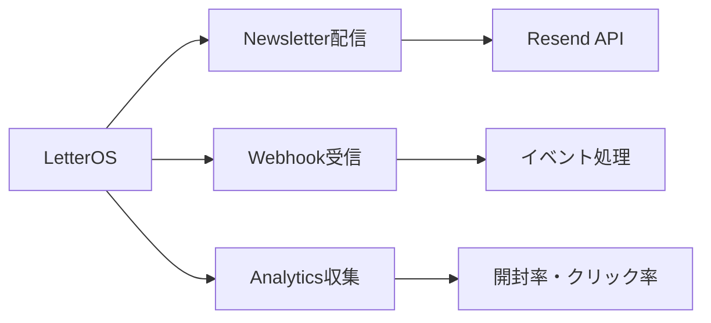

# Resend Integration Guide - Email Delivery

## 📚 目次

1. Resendの概要とLetterOSでの活用
2. セットアップと認証
3. メールテンプレート設計
4. 配信パイプラインの実装
5. Webhookによるイベントトラッキング
6. 分析とレポーティング
7. エラーハンドリングとリトライ
8. 実装パターン集

## 1. Resendの概要とLetterOSでの活用

Resendは、開発者体験に特化したモダンなメール配信APIです。LetterOSでは、メルマガ配信、トランザクショナルメール、アナリティクス収集にResendを活用します。

### Resendを選ぶ理由

1. **開発者体験**: シンプルで直感的なAPI
2. **React Email統合**: TypeSafeなメールテンプレート
3. **Webhook**: 詳細なイベントトラッキング
4. **信頼性**: 高い到達率とパフォーマンス
5. **Next.js親和性**: Vercelエコシステムとの親和性

### LetterOSでのユースケース



## 2. セットアップと認証

### インストール

```bash
npm install resend react-email @react-email/components
```

### 環境変数設定

```bash
# .env
RESEND_API_KEY="re_..."
RESEND_WEBHOOK_SECRET="whsec_..."
```

### APIキーの取得

1. [Resend Dashboard](https://resend.com/api-keys)にアクセス
2. API Keyを作成
3. `.env`ファイルに追加

### Resendクライアント初期化

```typescript
// lib/resend.ts
import { Resend } from 'resend';

if (!process.env.RESEND_API_KEY) {
  throw new Error('RESEND_API_KEY is not defined');
}

export const resend = new Resend(process.env.RESEND_API_KEY);

// ドメイン検証状態をチェック
export async function checkDomainStatus() {
  const domains = await resend.domains.list();
  return domains.data;
}
```

### ドメイン設定

```bash
# Resendダッシュボードでドメインを追加
# DNS設定（MX, TXT, CNAME）を行う

# 検証
resend domains verify <domain-id>
```

## 3. メールテンプレート設計

### React Emailによるテンプレート

```tsx
// emails/newsletter.tsx
import {
  Body,
  Button,
  Container,
  Head,
  Heading,
  Hr,
  Html,
  Link,
  Preview,
  Section,
  Text,
} from '@react-email/components';

interface NewsletterEmailProps {
  title: string;
  content: string;
  ctaText?: string;
  ctaUrl?: string;
  unsubscribeUrl: string;
}

export default function NewsletterEmail({
  title,
  content,
  ctaText,
  ctaUrl,
  unsubscribeUrl,
}: NewsletterEmailProps) {
  return (
    <Html>
      <Head />
      <Preview>{title}</Preview>
      <Body style={main}>
        <Container style={container}>
          {/* ヘッダー */}
          <Section style={header}>
            <Heading style={h1}>LetterOS</Heading>
          </Section>

          {/* タイトル */}
          <Heading style={h2}>{title}</Heading>

          {/* 本文 */}
          <Text style={paragraph}>{content}</Text>

          {/* CTA */}
          {ctaText && ctaUrl && (
            <Section style={buttonContainer}>
              <Button style={button} href={ctaUrl}>
                {ctaText}
              </Button>
            </Section>
          )}

          <Hr style={hr} />

          {/* フッター */}
          <Section style={footer}>
            <Text style={footerText}>
              このメールを受信したくない場合は、
              <Link href={unsubscribeUrl} style={link}>
                配信停止
              </Link>
              してください。
            </Text>
          </Section>
        </Container>
      </Body>
    </Html>
  );
}

// スタイル定義
const main = {
  backgroundColor: '#f6f9fc',
  fontFamily:
    '-apple-system,BlinkMacSystemFont,"Segoe UI",Roboto,"Helvetica Neue",Ubuntu,sans-serif',
};

const container = {
  backgroundColor: '#ffffff',
  margin: '0 auto',
  padding: '20px 0 48px',
  marginBottom: '64px',
};

const header = {
  padding: '0 48px',
};

const h1 = {
  color: '#1a1a1a',
  fontSize: '24px',
  fontWeight: 'bold',
  margin: '40px 0',
  padding: '0',
};

const h2 = {
  color: '#1a1a1a',
  fontSize: '20px',
  fontWeight: 'bold',
  margin: '0 0 15px',
  padding: '0 48px',
};

const paragraph = {
  color: '#525252',
  fontSize: '16px',
  lineHeight: '26px',
  padding: '0 48px',
  margin: '16px 0',
};

const buttonContainer = {
  padding: '27px 48px',
};

const button = {
  backgroundColor: '#3b82f6',
  borderRadius: '5px',
  color: '#fff',
  fontSize: '16px',
  fontWeight: 'bold',
  textDecoration: 'none',
  textAlign: 'center' as const,
  display: 'block',
  padding: '12px 20px',
};

const hr = {
  borderColor: '#e6ebf1',
  margin: '20px 0',
};

const footer = {
  padding: '0 48px',
};

const footerText = {
  color: '#8898aa',
  fontSize: '12px',
  lineHeight: '16px',
};

const link = {
  color: '#3b82f6',
  textDecoration: 'underline',
};
```

### テンプレートのプレビュー

```typescript
// scripts/preview-email.ts
import { render } from '@react-email/render';
import NewsletterEmail from '../emails/newsletter';

const html = render(
  <NewsletterEmail
    title="プロンプトエンジニアリングの秘訣"
    content="AIの出力品質を10倍にする3つの原則をご紹介します..."
    ctaText="記事を読む"
    ctaUrl="https://example.com/article"
    unsubscribeUrl="https://example.com/unsubscribe"
  />
);

console.log(html);
```

## 4. 配信パイプラインの実装

### 単一メール送信

```typescript
// lib/email/send.ts
import { resend } from '@/lib/resend';
import NewsletterEmail from '@/emails/newsletter';

interface SendNewsletterParams {
  to: string;
  subject: string;
  title: string;
  content: string;
  ctaText?: string;
  ctaUrl?: string;
  newsletterId: string;
  subscriberId: string;
}

export async function sendNewsletter(params: SendNewsletterParams) {
  const unsubscribeUrl = `${process.env.NEXT_PUBLIC_URL}/unsubscribe?subscriber=${params.subscriberId}`;

  const { data, error } = await resend.emails.send({
    from: 'LetterOS <newsletter@yourdomain.com>',
    to: params.to,
    subject: params.subject,
    react: NewsletterEmail({
      title: params.title,
      content: params.content,
      ctaText: params.ctaText,
      ctaUrl: params.ctaUrl,
      unsubscribeUrl,
    }),
    tags: [
      {
        name: 'newsletter_id',
        value: params.newsletterId,
      },
      {
        name: 'subscriber_id',
        value: params.subscriberId,
      },
    ],
  });

  if (error) {
    throw new Error(`Failed to send email: ${error.message}`);
  }

  return data;
}
```

### バッチ配信（大量送信）

```typescript
// lib/email/batch-send.ts
import { db } from '@/lib/db';
import { sendNewsletter } from './send';

interface BatchSendParams {
  newsletterId: string;
  segmentId?: string;
  batchSize?: number;
}

export async function batchSendNewsletter(params: BatchSendParams) {
  const { newsletterId, segmentId, batchSize = 100 } = params;

  // ニュースレター取得
  const newsletter = await db.newsletter.findUnique({
    where: { id: newsletterId },
  });

  if (!newsletter) {
    throw new Error('Newsletter not found');
  }

  // 購読者取得
  const subscribers = await db.subscriber.findMany({
    where: {
      status: 'ACTIVE',
      ...(segmentId && { segmentId }),
    },
  });

  console.log(`Sending to ${subscribers.length} subscribers...`);

  // バッチ処理
  const batches = chunkArray(subscribers, batchSize);

  for (const [index, batch] of batches.entries()) {
    console.log(`Processing batch ${index + 1}/${batches.length}...`);

    await Promise.all(
      batch.map(async (subscriber) => {
        try {
          const { id: resendId } = await sendNewsletter({
            to: subscriber.email,
            subject: newsletter.title,
            title: newsletter.title,
            content: newsletter.content,
            newsletterId: newsletter.id,
            subscriberId: subscriber.id,
          });

          // Email レコード作成
          await db.email.create({
            data: {
              newsletterId: newsletter.id,
              subscriberId: subscriber.id,
              subject: newsletter.title,
              status: 'SENT',
              resendId,
              sentAt: new Date(),
            },
          });
        } catch (error) {
          console.error(`Failed to send to ${subscriber.email}:`, error);

          // エラーログ
          await db.email.create({
            data: {
              newsletterId: newsletter.id,
              subscriberId: subscriber.id,
              subject: newsletter.title,
              status: 'FAILED',
              errorMessage: error instanceof Error ? error.message : 'Unknown error',
            },
          });
        }
      })
    );

    // レート制限を避けるため少し待つ
    if (index < batches.length - 1) {
      await sleep(1000); // 1秒待機
    }
  }

  // ステータス更新
  await db.newsletter.update({
    where: { id: newsletterId },
    data: {
      status: 'SENT',
      sentAt: new Date(),
    },
  });

  return { sent: subscribers.length };
}

function chunkArray<T>(array: T[], size: number): T[][] {
  const chunks: T[][] = [];
  for (let i = 0; i < array.length; i += size) {
    chunks.push(array.slice(i, i + size));
  }
  return chunks;
}

function sleep(ms: number) {
  return new Promise((resolve) => setTimeout(resolve, ms));
}
```

### スケジュール配信

```typescript
// lib/email/schedule.ts
import { db } from '@/lib/db';
import { batchSendNewsletter } from './batch-send';

export async function scheduleNewsletter(
  newsletterId: string,
  scheduledAt: Date
) {
  await db.newsletter.update({
    where: { id: newsletterId },
    data: {
      status: 'SCHEDULED',
      scheduledAt,
    },
  });
}

// Cron Job (毎分実行)
export async function processScheduledNewsletters() {
  const now = new Date();

  const scheduled = await db.newsletter.findMany({
    where: {
      status: 'SCHEDULED',
      scheduledAt: {
        lte: now,
      },
    },
  });

  for (const newsletter of scheduled) {
    try {
      await db.newsletter.update({
        where: { id: newsletter.id },
        data: { status: 'SENDING' },
      });

      await batchSendNewsletter({
        newsletterId: newsletter.id,
        segmentId: newsletter.segmentId || undefined,
      });

      console.log(`Newsletter ${newsletter.id} sent successfully`);
    } catch (error) {
      console.error(`Failed to send newsletter ${newsletter.id}:`, error);

      await db.newsletter.update({
        where: { id: newsletter.id },
        data: { status: 'FAILED' },
      });
    }
  }
}
```

## 5. Webhookによるイベントトラッキング

### Webhook設定

```typescript
// app/api/webhooks/resend/route.ts
import { NextRequest, NextResponse } from 'next/server';
import { headers } from 'next/headers';
import { db } from '@/lib/db';

export async function POST(request: NextRequest) {
  const body = await request.text();
  const headersList = await headers();
  const signature = headersList.get('resend-signature');

  // 署名検証
  if (!verifyWebhookSignature(body, signature)) {
    return NextResponse.json({ error: 'Invalid signature' }, { status: 401 });
  }

  const event = JSON.parse(body);

  // イベントタイプに応じた処理
  switch (event.type) {
    case 'email.sent':
      await handleEmailSent(event);
      break;

    case 'email.delivered':
      await handleEmailDelivered(event);
      break;

    case 'email.opened':
      await handleEmailOpened(event);
      break;

    case 'email.clicked':
      await handleEmailClicked(event);
      break;

    case 'email.bounced':
      await handleEmailBounced(event);
      break;

    case 'email.complained':
      await handleEmailComplained(event);
      break;

    default:
      console.log(`Unhandled event type: ${event.type}`);
  }

  return NextResponse.json({ received: true });
}

function verifyWebhookSignature(body: string, signature: string | null): boolean {
  if (!signature) return false;

  // Resendの署名検証ロジック
  const webhookSecret = process.env.RESEND_WEBHOOK_SECRET;
  // 実際の検証実装
  return true; // 簡略化
}

async function handleEmailSent(event: any) {
  const { email_id, tags } = event.data;

  const newsletterId = tags.find((t: any) => t.name === 'newsletter_id')?.value;

  if (newsletterId) {
    await db.email.updateMany({
      where: { resendId: email_id },
      data: { status: 'SENT' },
    });
  }
}

async function handleEmailDelivered(event: any) {
  const { email_id } = event.data;

  await db.email.updateMany({
    where: { resendId: email_id },
    data: {
      status: 'DELIVERED',
      deliveredAt: new Date(),
    },
  });

  // EmailEventログ
  await db.emailEvent.create({
    data: {
      emailId: email_id,
      type: 'DELIVERED',
      metadata: event.data,
    },
  });
}

async function handleEmailOpened(event: any) {
  const { email_id } = event.data;

  const email = await db.email.findFirst({
    where: { resendId: email_id },
  });

  if (email) {
    // 初回開封のみカウント
    if (email.status !== 'OPENED') {
      await db.email.update({
        where: { id: email.id },
        data: {
          status: 'OPENED',
          openedAt: new Date(),
        },
      });

      // アナリティクス更新
      await incrementAnalytics(email.newsletterId, 'opened');
    }

    // イベントログ（複数回開封も記録）
    await db.emailEvent.create({
      data: {
        emailId: email.id,
        type: 'OPENED',
        metadata: event.data,
      },
    });
  }
}

async function handleEmailClicked(event: any) {
  const { email_id, link } = event.data;

  const email = await db.email.findFirst({
    where: { resendId: email_id },
  });

  if (email) {
    if (email.status !== 'CLICKED') {
      await db.email.update({
        where: { id: email.id },
        data: {
          status: 'CLICKED',
          clickedAt: new Date(),
        },
      });

      await incrementAnalytics(email.newsletterId, 'clicked');
    }

    await db.emailEvent.create({
      data: {
        emailId: email.id,
        type: 'CLICKED',
        metadata: { ...event.data, link },
      },
    });
  }
}

async function handleEmailBounced(event: any) {
  const { email_id } = event.data;

  const email = await db.email.findFirst({
    where: { resendId: email_id },
    include: { subscriber: true },
  });

  if (email) {
    await db.email.update({
      where: { id: email.id },
      data: { status: 'BOUNCED' },
    });

    // 購読者をBOUNCEDステータスに
    await db.subscriber.update({
      where: { id: email.subscriberId },
      data: { status: 'BOUNCED' },
    });

    await incrementAnalytics(email.newsletterId, 'bounced');
  }
}

async function handleEmailComplained(event: any) {
  const { email_id } = event.data;

  const email = await db.email.findFirst({
    where: { resendId: email_id },
  });

  if (email) {
    await db.email.update({
      where: { id: email.id },
      data: { status: 'COMPLAINED' },
    });

    await db.subscriber.update({
      where: { id: email.subscriberId },
      data: { status: 'COMPLAINED' },
    });

    await incrementAnalytics(email.newsletterId, 'complained');
  }
}

async function incrementAnalytics(newsletterId: string, metric: string) {
  const analytics = await db.newsletterAnalytics.findUnique({
    where: { newsletterId },
  });

  if (!analytics) {
    await db.newsletterAnalytics.create({
      data: {
        newsletterId,
        [metric]: 1,
      },
    });
  } else {
    await db.newsletterAnalytics.update({
      where: { newsletterId },
      data: {
        [metric]: { increment: 1 },
      },
    });
  }

  // 率を再計算
  await recalculateRates(newsletterId);
}

async function recalculateRates(newsletterId: string) {
  const analytics = await db.newsletterAnalytics.findUnique({
    where: { newsletterId },
  });

  if (analytics && analytics.totalSent > 0) {
    const openRate = analytics.opened / analytics.totalSent;
    const clickRate = analytics.clicked / analytics.totalSent;
    const bounceRate = analytics.bounced / analytics.totalSent;

    await db.newsletterAnalytics.update({
      where: { newsletterId },
      data: { openRate, clickRate, bounceRate },
    });
  }
}
```

## 6. 分析とレポーティング

### ダッシュボードAPI

```typescript
// app/api/newsletters/[id]/analytics/route.ts
import { NextRequest, NextResponse } from 'next/server';
import { db } from '@/lib/db';

export async function GET(
  request: NextRequest,
  { params }: { params: { id: string } }
) {
  const analytics = await db.newsletterAnalytics.findUnique({
    where: { newsletterId: params.id },
  });

  const emails = await db.email.findMany({
    where: { newsletterId: params.id },
    select: {
      status: true,
      sentAt: true,
      deliveredAt: true,
      openedAt: true,
      clickedAt: true,
    },
  });

  // 時系列データ
  const timeline = generateTimeline(emails);

  return NextResponse.json({
    summary: analytics,
    timeline,
  });
}

function generateTimeline(emails: any[]) {
  // 時間ごとの開封・クリック数を集計
  const hours = 24;
  const timeline = Array.from({ length: hours }, (_, i) => ({
    hour: i,
    opened: 0,
    clicked: 0,
  }));

  emails.forEach((email) => {
    if (email.openedAt) {
      const hour = new Date(email.openedAt).getHours();
      timeline[hour].opened++;
    }
    if (email.clickedAt) {
      const hour = new Date(email.clickedAt).getHours();
      timeline[hour].clicked++;
    }
  });

  return timeline;
}
```

## 7. エラーハンドリングとリトライ

### リトライロジック

```typescript
// lib/email/retry.ts
interface RetryOptions {
  maxRetries?: number;
  delayMs?: number;
  backoffMultiplier?: number;
}

export async function sendWithRetry<T>(
  fn: () => Promise<T>,
  options: RetryOptions = {}
): Promise<T> {
  const { maxRetries = 3, delayMs = 1000, backoffMultiplier = 2 } = options;

  let lastError: Error | undefined;

  for (let attempt = 0; attempt < maxRetries; attempt++) {
    try {
      return await fn();
    } catch (error) {
      lastError = error as Error;

      if (attempt < maxRetries - 1) {
        const delay = delayMs * Math.pow(backoffMultiplier, attempt);
        console.log(`Retry attempt ${attempt + 1} after ${delay}ms...`);
        await sleep(delay);
      }
    }
  }

  throw lastError;
}

// 使用例
await sendWithRetry(
  () =>
    sendNewsletter({
      to: subscriber.email,
      subject: newsletter.title,
      // ...
    }),
  { maxRetries: 3, delayMs: 2000 }
);
```

## 🌐 参照リソース

### 公式ドキュメント

1. [Resend Documentation](https://resend.com/docs) - Resend公式
2. [React Email](https://react.email/docs/introduction) - テンプレート作成
3. [Resend API Reference](https://resend.com/docs/api-reference/introduction) - API仕様
4. [Webhooks Guide](https://resend.com/docs/dashboard/webhooks/introduction) - Webhook設定
5. [Email Best Practices](https://resend.com/docs/knowledge-base/email-best-practices) - ベストプラクティス

### 実装記事

6. [Building Transactional Emails with React Email](https://resend.com/blog/react-email-with-resend) - 実装ガイド
7. [Email Deliverability Guide](https://www.validity.com/resource-center/email-deliverability-guide/) - 到達率向上
8. [DKIM, SPF, DMARC Setup](https://resend.com/docs/dashboard/domains/introduction) - ドメイン認証
9. [Email Analytics Best Practices](https://mailchimp.com/resources/email-marketing-benchmarks/) - 分析指標
10. [Batch Email Processing](https://vercel.com/guides/handling-batch-email-sending) - バッチ処理

---

**実装時間目安**: 基本統合 1人日、Webhook・分析 2人日
