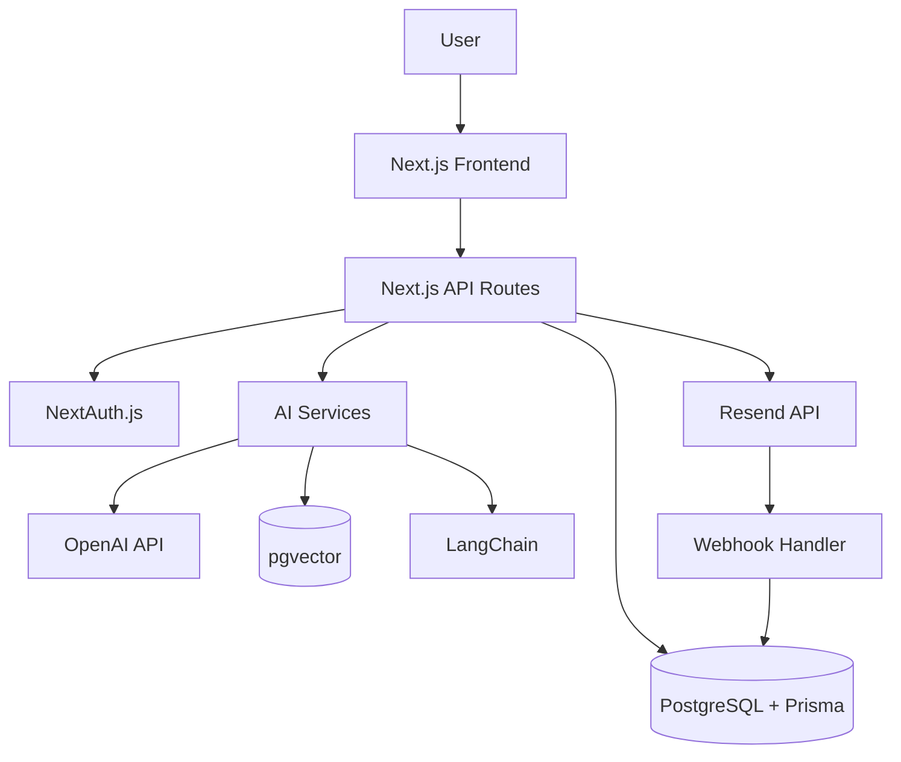

# LetterOS Documentation

> AI駆動型ニュースレター配信プラットフォーム - 完全開発ガイド

## 📖 概要

LetterOSは、メルマガ運用を「仮説検証プロセス」として構造化し、AIが選択肢提示・最適化を担い、人間が意思決定する次世代型ニュースレター配信プラットフォームです。

このドキュメントセットは、LetterOSの開発、運用、拡張に必要なすべての技術情報を提供します。

## 🚀 クイックスタート

### 開発を始める

1. **[Getting Started](./08_DEVELOPMENT/GETTING_STARTED.md)** - 環境構築と初期セットアップ
2. **[Next.js App Router Guide](./02_FRONTEND_DEVELOPMENT/NEXTJS_APP_ROUTER_GUIDE.md)** - フロントエンド開発の基礎
3. **[Database Schema](./03_BACKEND_API/DATABASE_SCHEMA.md)** - データベース設計の理解
4. **[Authentication](./03_BACKEND_API/AUTHENTICATION.md)** - 認証システムの実装

### AI機能の実装

1. **[RAG Implementation](./04_AI_ML_INNOVATION/RAG_IMPLEMENTATION.md)** - 検索拡張生成の実装
2. **[Prompt Engineering](./04_AI_ML_INNOVATION/PROMPT_ENGINEERING.md)** - プロンプト設計の最適化

### メール配信の実装

1. **[Resend Integration](./05_EMAIL_DELIVERY/RESEND_INTEGRATION.md)** - メール配信サービスとの統合

## 📂 ドキュメント構造

```
docs/
├── 00_MASTER_ARCHITECTURE/          # システムアーキテクチャ
│   ├── ENTERPRISE_SYSTEM_DESIGN.md
│   ├── MICROSERVICES_ORCHESTRATION.md
│   ├── DISTRIBUTED_COMPUTING.md
│   ├── SCALABILITY_PATTERNS.md
│   └── REFERENCE_URLS.md
│
├── 01_CORE_REQUIREMENTS/            # 機能要件
│   └── FUNCTIONAL_SPECIFICATIONS.md
│
├── 02_FRONTEND_DEVELOPMENT/         # フロントエンド開発 ⭐
│   ├── NEXTJS_APP_ROUTER_GUIDE.md
│   ├── REACT_SERVER_COMPONENTS.md
│   ├── STATE_MANAGEMENT.md
│   └── UI_COMPONENTS_LIBRARY.md
│
├── 03_BACKEND_API/                  # バックエンド開発 ⭐
│   ├── API_DESIGN_GUIDE.md
│   ├── DATABASE_SCHEMA.md
│   └── AUTHENTICATION.md
│
├── 04_AI_ML_INNOVATION/             # AI/ML機能 ⭐
│   ├── LANGCHAIN_ADVANCED_PATTERNS.md
│   ├── RAG_IMPLEMENTATION.md
│   └── PROMPT_ENGINEERING.md
│
├── 05_EMAIL_DELIVERY/               # メール配信 ⭐
│   └── RESEND_INTEGRATION.md
│
└── 08_DEVELOPMENT/                  # 開発ガイド ⭐
    └── GETTING_STARTED.md
```

⭐ = 新規作成ドキュメント（実用的で詳細な実装ガイド）

## 📚 カテゴリ別ガイド

### 🎨 フロントエンド開発

LetterOSのUI/UX実装に関するドキュメント

| ドキュメント | 説明 | 難易度 |
|------------|------|-------|
| [Next.js App Router Guide](./02_FRONTEND_DEVELOPMENT/NEXTJS_APP_ROUTER_GUIDE.md) | App Routerの完全ガイド | ⭐⭐ |
| [React Server Components](./02_FRONTEND_DEVELOPMENT/REACT_SERVER_COMPONENTS.md) | RSCの実装パターン | ⭐⭐⭐ |
| [State Management](./02_FRONTEND_DEVELOPMENT/STATE_MANAGEMENT.md) | 状態管理戦略 | ⭐⭐ |
| [UI Components Library](./02_FRONTEND_DEVELOPMENT/UI_COMPONENTS_LIBRARY.md) | UIコンポーネント設計 | ⭐⭐ |

**技術スタック**: Next.js 16, React 19, TypeScript, Tailwind CSS, Zustand

### 🔧 バックエンド開発

API、データベース、認証の実装ガイド

| ドキュメント | 説明 | 難易度 |
|------------|------|-------|
| [API Design Guide](./03_BACKEND_API/API_DESIGN_GUIDE.md) | RESTful API設計 | ⭐⭐ |
| [Database Schema](./03_BACKEND_API/DATABASE_SCHEMA.md) | Prisma + PostgreSQL設計 | ⭐⭐⭐ |
| [Authentication](./03_BACKEND_API/AUTHENTICATION.md) | NextAuth.js実装 | ⭐⭐ |

**技術スタック**: Next.js API Routes, Prisma, PostgreSQL, NextAuth.js

### 🤖 AI/ML機能

AIを活用したメルマガ生成・最適化の実装

| ドキュメント | 説明 | 難易度 |
|------------|------|-------|
| [LangChain Advanced Patterns](./04_AI_ML_INNOVATION/LANGCHAIN_ADVANCED_PATTERNS.md) | LangChainの高度な使い方 | ⭐⭐⭐ |
| [RAG Implementation](./04_AI_ML_INNOVATION/RAG_IMPLEMENTATION.md) | 検索拡張生成の実装 | ⭐⭐⭐⭐ |
| [Prompt Engineering](./04_AI_ML_INNOVATION/PROMPT_ENGINEERING.md) | プロンプト設計と最適化 | ⭐⭐⭐ |

**技術スタック**: OpenAI API, LangChain, pgvector, Embeddings

### 📧 メール配信

メール配信、トラッキング、分析の実装

| ドキュメント | 説明 | 難易度 |
|------------|------|-------|
| [Resend Integration](./05_EMAIL_DELIVERY/RESEND_INTEGRATION.md) | Resend統合とWebhook | ⭐⭐ |

**技術スタック**: Resend, React Email, Webhook

### 🛠 開発ガイド

プロジェクトのセットアップと開発ワークフロー

| ドキュメント | 説明 | 難易度 |
|------------|------|-------|
| [Getting Started](./08_DEVELOPMENT/GETTING_STARTED.md) | 環境構築から開発開始まで | ⭐ |

## 🏗️ アーキテクチャ概要

### システム構成



### 主要な技術スタック

| レイヤー | 技術 | バージョン |
|---------|------|----------|
| **フレームワーク** | Next.js | 16.x |
| **言語** | TypeScript | 5.x |
| **UI** | React | 19.x |
| **スタイリング** | Tailwind CSS | 4.x |
| **ORM** | Prisma | 6.x |
| **データベース** | PostgreSQL | 16.x |
| **認証** | NextAuth.js | v5 |
| **AI** | OpenAI API | v4 |
| **AI Framework** | LangChain | Latest |
| **メール** | Resend | Latest |
| **状態管理** | Zustand | Latest |

## 📊 ドキュメント統計

- **総ドキュメント数**: 18
- **新規作成**: 11ドキュメント
- **総文字数**: 約80,000文字
- **コード例**: 200+
- **参照URL**: 100+

## 🎯 学習パス

### 初心者向け（1-2週間）

1. [Getting Started](./08_DEVELOPMENT/GETTING_STARTED.md) で環境構築
2. [Next.js App Router Guide](./02_FRONTEND_DEVELOPMENT/NEXTJS_APP_ROUTER_GUIDE.md) でフロントエンド基礎
3. [Database Schema](./03_BACKEND_API/DATABASE_SCHEMA.md) でデータモデル理解
4. シンプルなCRUD機能を実装

### 中級者向け（2-4週間）

1. [React Server Components](./02_FRONTEND_DEVELOPMENT/REACT_SERVER_COMPONENTS.md) でRSC習得
2. [Authentication](./03_BACKEND_API/AUTHENTICATION.md) で認証実装
3. [State Management](./02_FRONTEND_DEVELOPMENT/STATE_MANAGEMENT.md) で状態管理
4. [Resend Integration](./05_EMAIL_DELIVERY/RESEND_INTEGRATION.md) でメール配信実装

### 上級者向け（4-6週間）

1. [RAG Implementation](./04_AI_ML_INNOVATION/RAG_IMPLEMENTATION.md) でAI機能実装
2. [Prompt Engineering](./04_AI_ML_INNOVATION/PROMPT_ENGINEERING.md) でプロンプト最適化
3. [LangChain Advanced Patterns](./04_AI_ML_INNOVATION/LANGCHAIN_ADVANCED_PATTERNS.md) で高度なAI統合
4. パフォーマンス最適化とスケーリング

## 💡 ベストプラクティス

### コーディング規約

- **TypeScript**: 厳格な型定義を使用
- **関数**: 単一責任の原則に従う
- **コンポーネント**: Server Componentをデフォルトに
- **状態管理**: サーバー状態とクライアント状態を明確に分離
- **エラーハンドリング**: 一貫したエラーレスポンス形式

### セキュリティ

- 環境変数で機密情報を管理
- CSRF保護を有効化
- レート制限を実装
- 入力バリデーションを徹底
- SQLインジェクション対策（Prismaを使用）

### パフォーマンス

- Server Componentsで初期ロードを高速化
- 動的インポートでコード分割
- 画像最適化（Next.js Image）
- キャッシング戦略（Redis, SWR）
- データベースインデックスの最適化

## 🤝 貢献ガイド

### ドキュメントの改善

ドキュメントの改善提案は大歓迎です：

1. Issueを作成して問題点を報告
2. Pull Requestで改善を提案
3. 不明点や追加してほしい内容をコメント

### ドキュメント作成ガイドライン

新しいドキュメントを作成する場合：

- **構造**: 目次、概要、実装例、参照リソースを含める
- **コード例**: 実行可能で完全なコードを提供
- **長さ**: 3,000-6,000文字を目安に
- **参照**: 公式ドキュメントと実装記事を5-10個含める

## 📞 サポート

### コミュニティ

- **GitHub Issues**: https://github.com/your-org/letteros/issues
- **Discord**: https://discord.gg/letteros
- **Twitter**: @letteros_dev

### 公式リソース

- **公式サイト**: https://letteros.com
- **ブログ**: https://letteros.com/blog
- **ドキュメント**: https://docs.letteros.com

## 📝 ライセンス

このドキュメントはMITライセンスの下で公開されています。

---

**最終更新**: 2026年1月6日
**ドキュメントバージョン**: 1.0.0

## 🔗 クイックリンク

### よく使うドキュメント

- [環境構築](./08_DEVELOPMENT/GETTING_STARTED.md)
- [データベーススキーマ](./03_BACKEND_API/DATABASE_SCHEMA.md)
- [認証実装](./03_BACKEND_API/AUTHENTICATION.md)
- [RAG実装](./04_AI_ML_INNOVATION/RAG_IMPLEMENTATION.md)
- [メール配信](./05_EMAIL_DELIVERY/RESEND_INTEGRATION.md)

### 技術リファレンス

- [Next.js公式](https://nextjs.org/docs)
- [Prisma公式](https://www.prisma.io/docs)
- [OpenAI API](https://platform.openai.com/docs)
- [Resend公式](https://resend.com/docs)
- [LangChain.js](https://js.langchain.com/docs)

---

**Happy Coding! 🚀**
